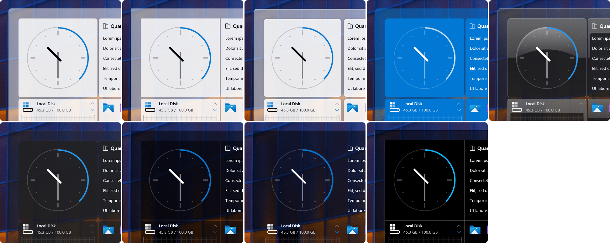
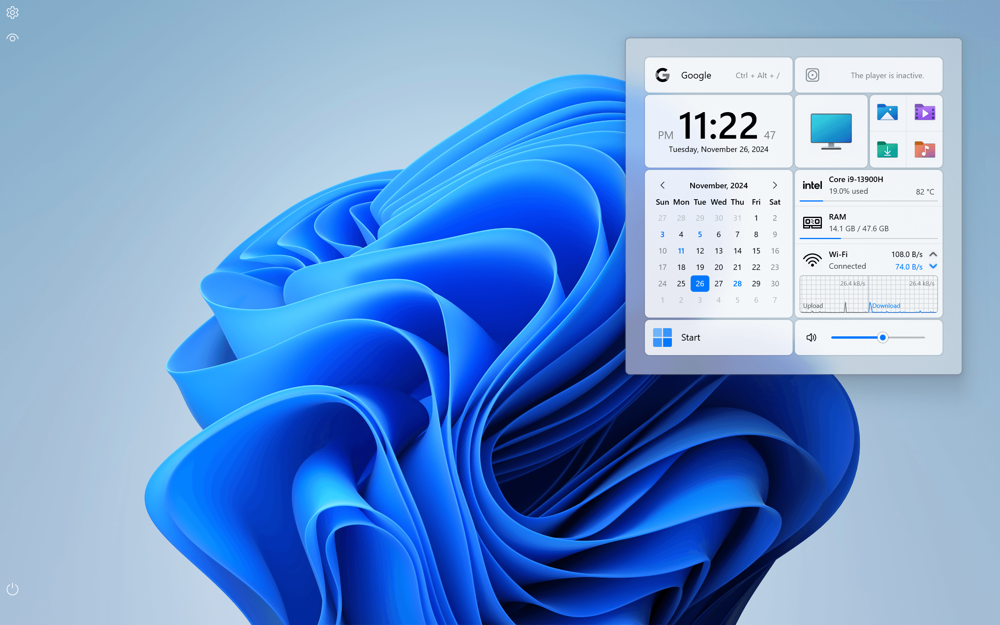
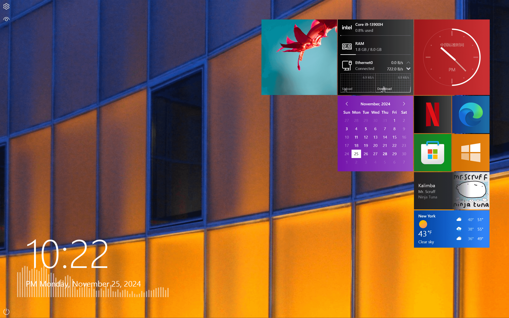

<!-- Turn off word wrap, change the indentation method to Tab, and adjust the Tab Size to 8 to avoid typographical confusion. -->

	

		
		 
		A desktop customization tool based on Rainmeter
	

	

		
		
		
		
		
		
		 
		<a href="https://www.patreon.com/posts/119206461"><kbd>Changelog of Quanto Flx 2.00 Delta (Build 1101)</kbd></a> 
		<!-- <a href="https://www.patreon.com/posts/119206461"><kbd>Learn about the latest news of upcoming Delta (Build 1101)</kbd></a>  -->
	

	

		English | <a href="/README.zh-hans.md">中文 (简体)</a>
	

# ¿Quanto? ¡Mucho!

<!-- ## Fixed, also Flexible -->

## Quantity and Quality

Quanto Flx comes with 4 pre-installed packages that contain **160+ distinctive panels with various styles or sizes, 260 preset shortcuts with customizable icons and banners and 80+ other highly customizable components**!

### Quanto Flx Gadgets

Gadgets for your everyday use.

| Icon																																													| Name			| Description									| Available Styles/Sizes										| Features																															|
|-----------------------------------------------------------------------------------------------------------------------------------------------------------------------------------------------------------------------------------------------------------------------------------------------------------------------------------------------------------------------|-----------------------|-------------------------------------------------------------------------------|-------------------------------------------------------------------------------------------------------|---------------------------------------------------------------------------------------------------------------------------------------------------------------------------------------------------------------------------------------------------------------|
| <picture>	<source srcset=".github/images/QuantoFlx.Gadgets/IconSquare/Calculator_0.png" media="(prefers-color-scheme: light)">	<source srcset=".github/images/QuantoFlx.Gadgets/IconSquare/Calculator_1.png" media="(prefers-color-scheme: dark)">		</picture>	| Calculator		| A simple desktop calculator.							| `4x4` `4x5`												| Playing sound when clicking button.																												|
| <picture>	<source srcset=".github/images/QuantoFlx.Gadgets/IconSquare/Calendar_0.png" media="(prefers-color-scheme: light)">	<source srcset=".github/images/QuantoFlx.Gadgets/IconSquare/Calendar_1.png" media="(prefers-color-scheme: dark)">		</picture>	| Calendar		| Shows today's date or the calendar for the month.				| `2x2*2` `4x4`												| Starting on Monday or not; Customizable list of events.																									|
| <picture>	<source srcset=".github/images/QuantoFlx.Gadgets/IconSquare/Clock_0.png" media="(prefers-color-scheme: light)">		<source srcset=".github/images/QuantoFlx.Gadgets/IconSquare/Clock_1.png" media="(prefers-color-scheme: dark)">				</picture>	| Clock			| Displays the current time in the form of a digital or skeuomorphic clock.	| `2x1` `2x2` `4x2` `4x4`										| Text align; Show or hide second or AM/PM indicator; Show second as a hand instead of a circle or not; Customizable clock face; etc. Up to 8 clone skins can exist at the same time.										|
| <picture>	<source srcset=".github/images/QuantoFlx.Gadgets/IconSquare/Desktop_0.png" media="(prefers-color-scheme: light)">	<source srcset=".github/images/QuantoFlx.Gadgets/IconSquare/Desktop_1.png" media="(prefers-color-scheme: dark)">		</picture>	| Desktop		| Click to show or hide skins on the desktop.					| `1x1` & customizable size										| -																																|
| <picture>	<source srcset=".github/images/QuantoFlx.Gadgets/IconSquare/FolderViewer_0.png" media="(prefers-color-scheme: light)">	<source srcset=".github/images/QuantoFlx.Gadgets/IconSquare/FolderViewer_1.png" media="(prefers-color-scheme: dark)">		</picture>	| Folder Viewer		| Displays the contents of a folder.						| Customizable size in the style of List, horizontal & vertical icons (Dock-like)			| One skin can display 4 to 32 files/folders of any local path at the same time. Show or hide files or folders. Up to 8 clone skins can exist at the same time.													|
| <picture>	<source srcset=".github/images/QuantoFlx.Gadgets/IconSquare/Gallery_0.png" media="(prefers-color-scheme: light)">	<source srcset=".github/images/QuantoFlx.Gadgets/IconSquare/Gallery_1.png" media="(prefers-color-scheme: dark)">		</picture>	| Gallery		| Shuffle images from a folder.							| Customizable size											| -																																|
| <picture>	<source srcset=".github/images/QuantoFlx.Gadgets/IconSquare/MediaControl_0.png" media="(prefers-color-scheme: light)">	<source srcset=".github/images/QuantoFlx.Gadgets/IconSquare/MediaControl_1.png" media="(prefers-color-scheme: dark)">		</picture>	| Media Control		| To control your music player in your fingertips.				| `1x1` `2x1` `2x2` `4x1` `4x2*2` `4x4`									| Supports players supported by `NowPlaying` Plugin[^1], and also adapts to `WebNowPlaying` Plugin[^2].																				|
| <picture>	<source srcset=".github/images/QuantoFlx.Gadgets/IconSquare/RSS_0.png" media="(prefers-color-scheme: light)">		<source srcset=".github/images/QuantoFlx.Gadgets/IconSquare/RSS_1.png" media="(prefers-color-scheme: dark)">				</picture>	| RSS Feeds		| Keep track of the latest news from your RSS feeds.				| Customizable size											| Supports reading RSS feeds that conform to the Atom specification. 15/30 titles can be read at a time. Up to 8 clone skins can exist at the same time.													|
| <picture>	<source srcset=".github/images/QuantoFlx.Gadgets/IconSquare/Search_0.png" media="(prefers-color-scheme: light)">	<source srcset=".github/images/QuantoFlx.Gadgets/IconSquare/Search_1.png" media="(prefers-color-scheme: dark)">				</picture>	| Search		| A simple desktop search bar.							| Customizable size											| You can choose Baidu, Google, Microsoft Bing, Wikipedia, Yahoo or Yandex as the search engine.																				|
| <picture>	<source srcset=".github/images/QuantoFlx.Gadgets/IconSquare/Start_0.png" media="(prefers-color-scheme: light)">		<source srcset=".github/images/QuantoFlx.Gadgets/IconSquare/Start_1.png" media="(prefers-color-scheme: dark)">				</picture>	| Start			| Like the Start button on the taskbar, click to open the Start menu.		| `1x1` `4x1` & Customizable size									| Customizable Start icon.																													|
| <picture>	<source srcset=".github/images/QuantoFlx.Gadgets/IconSquare/StickyNotes_0.png" media="(prefers-color-scheme: light)">	<source srcset=".github/images/QuantoFlx.Gadgets/IconSquare/StickyNotes_1.png" media="(prefers-color-scheme: dark)">		</picture>	| Sticky Notes		| A simple tool for documenting something.					| Customizable size											| These skins implement its functions by reading text files and also support [text formatting](https://github.com/stevehsudrawing/quantoflx/wiki/Manual-of-%22Quanto-Flx-Gadgets%22-Package#text-formatting). Up to 16 clone skins can exist at the same time.	|
| <picture>	<source srcset=".github/images/QuantoFlx.Gadgets/IconSquare/ToDoList_0.png" media="(prefers-color-scheme: light)">	<source srcset=".github/images/QuantoFlx.Gadgets/IconSquare/ToDoList_1.png" media="(prefers-color-scheme: dark)">		</picture>	| To-Do List		| A practical tool for recording matters.					| Customizable size											| Up to 8 clone skins can exist at the same time.																										|
| <picture>	<source srcset=".github/images/QuantoFlx.Gadgets/IconSquare/Weather_0.png" media="(prefers-color-scheme: light)">	<source srcset=".github/images/QuantoFlx.Gadgets/IconSquare/Weather_1.png" media="(prefers-color-scheme: dark)">		</picture>	| Weather		| See what the weather looks like around the world.				| Current/Today: `1x1` `2x2` `4x1` `4x2` `4x4` Daily/Hourly: `2x2` `4x1` `4x2*2` `4x4*2` `8x4`	| It is divided into four parts: "Current", "Daily", "Hourly" and "Today". No API key needed.																					|
| <picture>	<source srcset=".github/images/QuantoFlx.Gadgets/IconSquare/WorldClock_0.png" media="(prefers-color-scheme: light)">	<source srcset=".github/images/QuantoFlx.Gadgets/IconSquare/WorldClock_1.png" media="(prefers-color-scheme: dark)">		</picture>	| World Clock		| View time around the world.							| `4x2` `4x4` `8x4`											| -																																|

### Quanto Flx Miscellaneous

Here are more skins to decorate your desktop.

| Icon																																														| Name				| Description									| Available Styles/Sizes					| Features																			|
|-------------------------------------------------------------------------------------------------------------------------------------------------------------------------------------------------------------------------------------------------------------------------------------------------------------------------------------------------------------------------------|-------------------------------|-------------------------------------------------------------------------------|---------------------------------------------------------------|---------------------------------------------------------------------------------------------------------------------------------------------------------------|
| <picture>	<source srcset=".github/images/QuantoFlx.Misc/IconSquare/Background_0.png" media="(prefers-color-scheme: light)">		<source srcset=".github/images/QuantoFlx.Misc/IconSquare/Background_1.png" media="(prefers-color-scheme: dark)">		</picture>	| Background			| To acccommodate panels.							| Full screen, fixed width or height or customizable size	| Use the "Collapse" button around a fixed width or height style skin to use it as a sidebar. Up to 8 clone skins can exist at the same time.			|
| <picture>	<source srcset=".github/images/QuantoFlx.Misc/IconSquare/ControlBar_0.png" media="(prefers-color-scheme: light)">		<source srcset=".github/images/QuantoFlx.Misc/IconSquare/ControlBar_1.png" media="(prefers-color-scheme: dark)">		</picture>	| Control Bar			| Control skins in one bar.							| Vertical or horizontal					| Show or hide user image icon or/and Start icon; The two ends can be colored separately; Background color can be set.						|
| <picture>	<source srcset=".github/images/QuantoFlx.Misc/IconSquare/BlankPanel_0.png" media="(prefers-color-scheme: light)">		<source srcset=".github/images/QuantoFlx.Misc/IconSquare/BlankPanel_1.png" media="(prefers-color-scheme: dark)">		</picture>	| Blank Panel			| Make your own panel.								| Customizable size						| You can write your own Meter/Measures. Up to 16 clone skins can exist at the same time.									|
| <picture>	<source srcset=".github/images/QuantoFlx.Misc/IconSquare/Customization_0.png" media="(prefers-color-scheme: light)">		<source srcset=".github/images/QuantoFlx.Misc/IconSquare/Customization_1.png" media="(prefers-color-scheme: dark)">		</picture>	| Customizable Image Skin	| Just "paste" any picture on the desktop.					| Customizable size						| Can be used as a shortcut. Up to 16 clone skins can exist at the same time.											|
| <picture>	<source srcset=".github/images/QuantoFlx.Misc/IconSquare/CustomText_0.png" media="(prefers-color-scheme: light)">		<source srcset=".github/images/QuantoFlx.Misc/IconSquare/CustomText_1.png" media="(prefers-color-scheme: dark)">		</picture>	| Custom Text			| Put some word on the desktop.							| Customizable size						| Up to 16 clone skins can exist at the same time.														|
| <picture>	<source srcset=".github/images/QuantoFlx.Misc/IconSquare/DigitalClock_0.png" media="(prefers-color-scheme: light)">		<source srcset=".github/images/QuantoFlx.Misc/IconSquare/DigitalClock_1.png" media="(prefers-color-scheme: dark)">		</picture>	| Digital Clock			| You can choose to use a complete digital clock, or build one yourself.	| Customizable size						| This series of skins provides enough independent components for users to customize a digital clock. You can also use an integrated digital clock directly.	|
| <picture>	<source srcset=".github/images/QuantoFlx.Misc/IconSquare/DividingLine_0.png" media="(prefers-color-scheme: light)">		<source srcset=".github/images/QuantoFlx.Misc/IconSquare/DividingLine_1.png" media="(prefers-color-scheme: dark)">		</picture>	| Divider			| Dividers.									| Customizable size						| Up to 16 clone skins can exist at the same time.														|
| <picture>	<source srcset=".github/images/QuantoFlx.Misc/IconSquare/Ruler_0.png" media="(prefers-color-scheme: light)">			<source srcset=".github/images/QuantoFlx.Misc/IconSquare/Ruler_1.png" media="(prefers-color-scheme: dark)">				</picture>	| Ruler				| A tool to assist the user in placing the skin.				| Customizable size						| These skins take advantage of Rainmeter's automatic skin alignment feature to assist users in placing skins. Up to 4 clone skins can exist at the same time.	|
| <picture>	<source srcset=".github/images/QuantoFlx.Misc/IconSquare/SkeuomorphicClock_0.png" media="(prefers-color-scheme: light)">	<source srcset=".github/images/QuantoFlx.Misc/IconSquare/SkeuomorphicClock_1.png" media="(prefers-color-scheme: dark)">		</picture>	| Skeuomorphic Clock		| A wallpaper skeuomorphic clock.						| Customizable size						| Show or hide second or AM/PM indicator; Show second as a hand instead of a circle or not; Customizable clock face; Aero background[^3]; etc.			|
| <picture>	<source srcset=".github/images/QuantoFlx.Misc/IconSquare/TextOptions_0.png" media="(prefers-color-scheme: light)">		<source srcset=".github/images/QuantoFlx.Misc/IconSquare/TextOptions_1.png" media="(prefers-color-scheme: dark)">		</picture>	| Text Options			| Customizable shortcuts or superlinks.						| Customizable size						| One skin can display 4 entries at the same time. Up to 8 clone skins can exist at the same time.								|
| <picture>	<source srcset=".github/images/QuantoFlx.Misc/IconSquare/Visualiser_0.png" media="(prefers-color-scheme: light)">		<source srcset=".github/images/QuantoFlx.Misc/IconSquare/Visualiser_1.png" media="(prefers-color-scheme: dark)">		</picture>	| Visualiser			| Bring the music to the screen!						| 4 styles in horizontal, vertical and radial			| You can customize the width and height or radius, and set the reflection for horizontal or vertical style. The visualizer's appearance can also be flipped.	|

### Quanto Flx Shortcuts

Use the style of Quanto Flx to display shortcuts.

This package comes with 260 preset shortcuts and up to 240 custom shortcuts can be set.

	<picture>
		<source media="(prefers-color-scheme: light)" srcset=".github/images/QuantoFlx.Shortcuts/Images/Overview_0.png">
		<source media="(prefers-color-scheme: dark)" srcset=".github/images/QuantoFlx.Shortcuts/Images/Overview_1.png">
		
	</picture>

Shortcut skins have styles in `1x1`, `2x2`, `4x1`, `4x2`. 

### Quanto Flx System

These skins rely on system monitoring software (such as AIDA or HWiNFO) to provide a unified and detailed report on the use of system resources.

[Configure your system performance monitoring software](https://github.com/stevehsudrawing/quantoflx/wiki/Manual-of-%22Quanto-Flx-System%22-Package#before-you-use-them) for more features.

| Icon																																																| Name					| Description								| Available Styles/Sizes		| Features																		|
|-----------------------------------------------------------------------------------------------------------------------------------------------------------------------------------------------------------------------------------------------------------------------------------------------------------------------------------------------------------------------------------------------|---------------------------------------|-----------------------------------------------------------------------|---------------------------------------|-------------------------------------------------------------------------------------------------------------------------------------------------------|
| <picture>	<source srcset=".github/images/QuantoFlx.System/IconSquare/Battery_0.png" media="(prefers-color-scheme: light)">		<source srcset=".github/images/QuantoFlx.System/IconSquare/Battery_1.png" media="(prefers-color-scheme: dark)">						</picture>	| Battery				| Displays the current battery status.					| `1x1` `2x2` `4x1` `4x2` `Details*2`	| One of Generic System Monitoring Skins.														|
| <picture>	<source srcset=".github/images/QuantoFlx.System/IconSquare/CoolingFans_0.png" media="(prefers-color-scheme: light)">		<source srcset=".github/images/QuantoFlx.System/IconSquare/CoolingFans_1.png" media="(prefers-color-scheme: dark)">				</picture>	| Cooling Fans				| Displays the speed of the current cooling fan.			| `1x1` `2x2` `4x1`			| One of Generic System Monitoring Skins. Up to 8 clone skins can exist at the same time.								|
| <picture>	<source srcset=".github/images/QuantoFlx.System/IconSquare/Customization_0.png" media="(prefers-color-scheme: light)">		<source srcset=".github/images/QuantoFlx.System/IconSquare/Customization_1.png" media="(prefers-color-scheme: dark)">				</picture>	| Customizable System Monitoring Skins	| For the brave of you.							| `1x1` `2x2` `4x1` `4x2` `Details*2`	| One of Generic System Monitoring Skins. You can modify the parameters of this skin or add Measures. Up to 16 clone skins can exist at the same time.	|
| <picture>	<source srcset=".github/images/QuantoFlx.System/IconSquare/CPU_0.png" media="(prefers-color-scheme: light)">			<source srcset=".github/images/QuantoFlx.System/IconSquare/CPU_1.png" media="(prefers-color-scheme: dark)">						</picture>	| CPU					| Displays the current CPU usage and status.				| `1x1` `2x2` `4x1` `4x2` `Details*2`	| One of Generic System Monitoring Skins.														|
| <picture>	<source srcset=".github/images/QuantoFlx.System/IconSquare/CPUProcessors_0.png" media="(prefers-color-scheme: light)">		<source srcset=".github/images/QuantoFlx.System/IconSquare/CPUProcessors_1.png" media="(prefers-color-scheme: dark)">				</picture>	| CPU Processors			| Displays the current CPU usage for each processor.			| Adaptive				| One of Generic System Monitoring Skins.														|
| <picture>	<source srcset=".github/images/QuantoFlx.System/IconSquare/GPU_0.png" media="(prefers-color-scheme: light)">			<source srcset=".github/images/QuantoFlx.System/IconSquare/GPU_1.png" media="(prefers-color-scheme: dark)">						</picture>	| GPU					| Displays the current GPU usage and status.				| `1x1` `2x2` `4x1` `4x2` `Details*2`	| One of Generic System Monitoring Skins. Up to 8 clone skins can exist at the same time.								|
| <picture>	<source srcset=".github/images/QuantoFlx.System/IconSquare/Drives_0.png" media="(prefers-color-scheme: light)">			<source srcset=".github/images/QuantoFlx.System/IconSquare/Drives_1.png" media="(prefers-color-scheme: dark)">						</picture>	| Logical Drives			| Displays the occupancy and status of each drive.			| `1x1` `2x2` `4x1` `4x2` `Details`	| One of Generic System Monitoring Skins. Up to 26 clone skins can exist at the same time.								|
| <picture>	<source srcset=".github/images/QuantoFlx.System/IconSquare/Network_0.png" media="(prefers-color-scheme: light)">		<source srcset=".github/images/QuantoFlx.System/IconSquare/Network_1.png" media="(prefers-color-scheme: dark)">						</picture>	| Network				| Displays the traffic and the current network conditions.		| `1x1` `2x2` `4x1` `4x2` `Details*2`	| One of Generic System Monitoring Skins.														|
| <picture>	<source srcset=".github/images/QuantoFlx.System/IconSquare/PhysicalDrives_0.png" media="(prefers-color-scheme: light)">		<source srcset=".github/images/QuantoFlx.System/IconSquare/PhysicalDrives_1.png" media="(prefers-color-scheme: dark)">				</picture>	| Physical Drives			| Displays the status of physical drives.				| `1x1` `2x2` `4x1` `4x2` `Details*2`	| One of Generic System Monitoring Skins. Up to 8 clone skins can exist at the same time.								|
| <picture>	<source srcset=".github/images/QuantoFlx.System/IconSquare/RAM_0.png" media="(prefers-color-scheme: light)">			<source srcset=".github/images/QuantoFlx.System/IconSquare/RAM_1.png" media="(prefers-color-scheme: dark)">						</picture>	| RAM					| Displays the current RAM usage and status.				| `1x1` `2x2` `4x1` `4x2` `Details*2`	| One of Generic System Monitoring Skins.														|
| <picture>	<source srcset=".github/images/QuantoFlx.System/IconSquare/RecycleBin_0.png" media="(prefers-color-scheme: light)">		<source srcset=".github/images/QuantoFlx.System/IconSquare/RecycleBin_1.png" media="(prefers-color-scheme: dark)">				</picture>	| Recycle Bin				| Same as the "Recycle Bin" icon on the desktop.			| `1x1` `4x1` and Customizable size	| Drag a file into this skin to delete it. You can customize the icon that this skin displays in different situations.					|
| <picture>	<source srcset=".github/images/QuantoFlx.System/IconSquare/ScreenBrightness_0.png" media="(prefers-color-scheme: light)">	<source srcset=".github/images/QuantoFlx.System/IconSquare/ScreenBrightness_1.png" media="(prefers-color-scheme: dark)">		</picture>	| Screen Brightness			| Option to adjust the brightness of the screen.			| `4x1` `4x2`				| This skin is only available for screens that can adjust the brightness.										|
| <picture>	<source srcset=".github/images/QuantoFlx.System/IconSquare/System_0.png" media="(prefers-color-scheme: light)">			<source srcset=".github/images/QuantoFlx.System/IconSquare/System_1.png" media="(prefers-color-scheme: dark)">						</picture>	| System				| Displays the current status of the system.				| `4x1` `Details`			| One of Generic System Monitoring Skins. You can quickly copy your PC information.									|
| <picture>	<source srcset=".github/images/QuantoFlx.System/IconSquare/TopProcess_0.png" media="(prefers-color-scheme: light)">		<source srcset=".github/images/QuantoFlx.System/IconSquare/TopProcess_1.png" media="(prefers-color-scheme: dark)">				</picture>	| Top Process				| Displays the processes that use the highest resources.		| Customizable size			| Up to 4 clone skins (CPU, GPU, I/O, RAM) can exist at the same time.											|
| <picture>	<source srcset=".github/images/QuantoFlx.System/IconSquare/VideoMemory_0.png" media="(prefers-color-scheme: light)">		<source srcset=".github/images/QuantoFlx.System/IconSquare/VideoMemory_1.png" media="(prefers-color-scheme: dark)">				</picture>	| Video Memory				| Displays the current total video memory and usage.			| `1x1` `2x2` `4x1` `4x2`		| One of Generic System Monitoring Skins.														|
| <picture>	<source srcset=".github/images/QuantoFlx.System/IconSquare/Volume_0.png" media="(prefers-color-scheme: light)">			<source srcset=".github/images/QuantoFlx.System/IconSquare/Volume_1.png" media="(prefers-color-scheme: dark)">						</picture>	| Volume				| Options to adjust the global volume or the volume of each app.	| `4x1` and Customizable size		| Options to adjust the global volume or the volume of each app.											|

## Show Your Personality

	

In addition to the above features, each skin can also use features such as "combination", gradient background or opacity to make the layout more neat or show your personality.

At the same time, you can also conveniently use the "Style Clipboard" to copy the style of the skin and apply it to other skins.

	

Quanto Flx Global Settings provide a wealth of parameters that allow you to adjust many details of the appearance, such as the size or thickness of the font, position fine-tuning, the spacing between panels, lighting settings, and the size of the rounded corners of the global appearance, etc.

Don’t know where to start? Why not start with the preset themes provided by Quanto Flx! During the settings, Quanto Flx can provide an instant preview, without the need to refresh the skin after the settings are completed to see the effect.

	

## User-Friendly

	

You don't need to know too many details. Quanto Flx provides you with a user-friendly operation interface so that you can get started easily.

Quanto Flx provides some automation functions, such as changing the theme according to the time schedule, changing the accent color and foreground color according to the wallpaper; it also provides some practical functions, such as touch screen mode, displaying the background when the skin is selected, controlling the position layer of all skins, or locking the position of all skinsetc. These functions will provide you with more convenient customization.

No need to worry about upgrading or losing your settings! Quanto Flx provides a "Backup and Restore" feature to save your settings and use them to restore your settings after an update.

	

Having problems? [Quanto Flx Wiki](https://github.com/stevehsudrawing/quantoflx/wiki) has been written so you can always consult it in case you have any problems using this skin suite, or just want to see how the demos are implemented.

Quanto Flx is designed to be modular, which means you can write Quanto Flx Package to extend it. [Quanto Flx Specifications](https://github.com/stevehsudrawing/quantoflx/wiki/QFS) are also provided to learn how to write Quanto Flx skins and make Quanto Flx Packages.

## Globalization

Quanto Flx currently supports the following languages:

|														| Code		| Localized Name		| Contributor	|
|---------------------------------------------------------------------------------------------------------------|---------------|-------------------------------|---------------|
| 	| `en-us`	| English (United States)	| Steve Hsu	|
| 	| `zh-hans`	| 中文 (简体)			| Steve Hsu	|
| 	| `zh-hant`	| 中文 (繁體)			| Steve Hsu	|

Your contributions are always welcome! If you would like to contribute translations, please read [this document](https://github.com/stevehsudrawing/quantoflx/wiki/Guide-of-Translating-Quanto-Flx). The languages currently planned for translation in this project are:

|														| Code		| Localized Name	|
|---------------------------------------------------------------------------------------------------------------|---------------|-----------------------|
| 	| `de-de`	| Deutsch (Deutschland)	|
| 	| `es-es`	| Español (España)	|
| 	| `fr-fr`	| français (France)	|
| 	| `it-it`	| Italiano (Italia)	|
| 	| `ja-jp`	| 日本語 (日本)		|
| 	| `pt-br`	| Português (Brasil)	|
| 	| `ru-ru`	| Русский (Россия)	|

## Compatibility

Quanto Flx supports Windows 7 and newer. As long as your device can install the latest version of Rainmeter, you can also use Quanto Flx!

	

# Which version should I choose?

You are currently browsing **the `main` branch**.

| Branch									| [Release](https://github.com/stevehsudrawing/quantoflx/releases) Availability	| Description																																																					|
|-------------------------------------------------------------------------------|:-----------------------------------------------------------------------------:|-----------------------------------------------------------------------------------------------------------------------------------------------------------------------------------------------------------------------------------------------------------------------------------------------------------------------------------------------------------------------------------------------------------------------------------------------|
| **`main`**									| 🟩										| This branch pushes **releases and pre-releases**. If you want **a stable and long-term available version**, you should check out [the Release page](https://github.com/stevehsudrawing/quantoflx/releases), and download the **final release** version. You can also download **the pre-release version** to **experience newer features**. Translators should choose the latest version marked "Globalization Ready" for translation.	|
| [`snapshot`](https://github.com/stevehsudrawing/quantoflx/tree/snapshot)	| 🟥										| This branch pushes **snapshot versions**. If you **pursue the latest features**, you can choose this branch. However, it should be noted that since this branch is **updated frequently** and **the version may be extremely unstable**, you should choose it with caution.																					|

# How to Install

## Automatic Installation

1. Download and install the latest version of [Rainmeter](https://www.rainmeter.net/).

2. Go to the [Release page](https://github.com/stevehsudrawing/quantoflx/releases) to download the latest version of Quanto Flx Installation Package.

3. Click "Install". Then follow the prompts to initialize. [This article](https://github.com/stevehsudrawing/quantoflx/wiki/Guide-for-New-Users) may be helpful to you.

4. Enjoy!

## Manual Installation

First, you need to [install the latest version of Rainmeter](https://www.rainmeter.net/).

Then, **clone this repository to your local machine** via Git or GitHub Desktop instead of downloading the zip and then installing it manually:

> [!WARNING]
> Downloading the ZIP file of this repository to install may result in garbled text.

- The Plugins that need to be installed are listed below. You can view the Plugins you have installed in `%APPDATA%\Rainmeter\Plugins`. If some of these plugins do not exist on your device, click the hyperlink and download the latest version.

| Plugin								| Plugin								| Plugin								| Plugin								|
|-----------------------------------------------------------------------|-----------------------------------------------------------------------|-----------------------------------------------------------------------|-----------------------------------------------------------------------|
| [`AppVolume`](https://github.com/khanhas/AppVolumePlugin)		| [`Backlight`](https://forum.rainmeter.net/viewtopic.php?p=103782)	| [`Chameleon`](https://github.com/socks-the-fox/chameleon)		| [`ConfigActive`](https://github.com/jsmorley/ConfigActive)		|
| [`Drag&Drop`](https://github.com/TheAzack9/Drag-Drop)			| [`FileChoose`](https://forum.rainmeter.net/viewtopic.php?p=167079)	| [`FrostedGlass`](https://github.com/TheAzack9/FrostedGlass)		| [`HotKey`](https://github.com/brianferguson/HotKey.dll)		|
| [`Mouse`](https://github.com/NighthawkSLO/Mouse.dll)			| [`SysColor`](https://github.com/brianferguson/SysColor.dll)		| [`TrayIcon`](https://github.com/deathcrafter/PluginTrayIcon)		| [`WebNowPlaying`](https://github.com/keifufu/WebNowPlaying-Rainmeter)	|

- Copy/unzip (and overwrite) `QuantoFlx` folder in `Skins` folder to `%HOMEPATH%\Documents\Rainmeter\Skins`.

- Copy/unzip (and overwrite) `QuantoFlx` and `QuantoFlx_Setup` folders in `Layouts` folder to `%APPDATA%\Rainmeter\Layouts`.

Finally, refresh or restart Rainmeter and load the `QuantoFlx_Setup` layout in the Layouts page of the Rainmeter Manager. Enjoy!

# Screenshots

	
	
	
	

# Special Thanks

| Author	| Credit									| Credit									|
|---------------|-------------------------------------------------------------------------------|-------------------------------------------------------------------------------|
| Brian		| [`HotKey` Plugin](https://github.com/brianferguson/HotKey.dll)		| [`SysColor` Plugin](https://github.com/brianferguson/SysColor.dll/)		|
| Cfixd		| [`Backlight` Plugin](https://forum.rainmeter.net/viewtopic.php?p=103782)	|										|
| Death.crafter	| [`TrayIcon` Plugin](https://github.com/deathcrafter/PluginTrayIcon)		|										|
| JSMorley	| [`ConfigActive` Plugin](https://github.com/jsmorley/ConfigActive)		| [`RainRGB4`](https://forum.rainmeter.net/viewtopic.php?t=6215)		|
| Khanhas	| [`AppVolume` Plugin](https://github.com/khanhas/AppVolumePlugin)		|										|
| NighthawkSLO	| [`Mouse` Plugin](https://github.com/NighthawkSLO/Mouse.dll/)			|										|
| Open-Meteo	| [Weather Forecast API](https://github.com/open-meteo/open-meteo)		| [Air Quality API](https://github.com/open-meteo/open-meteo)			|
| Setsukka	| [`FileChoose` Plugin](https://forum.rainmeter.net/viewtopic.php?p=167079)	|										|
| Smurfier	| [`LuaCalendar`](https://forum.rainmeter.net/viewtopic.php?p=63288)		|										|
| Socks the Fox	| [`Chameleon` Plugin](https://github.com/socks-the-fox/chameleon)		|										|
| TheAzack9	| [`FrostedGlass` Plugin](https://github.com/TheAzack9/FrostedGlass)		| [`Drag&Drop` Plugin](https://github.com/TheAzack9/Drag-Drop)			|
| Tjhrulz	| [`WebNowPlaying` Plugin](https://github.com/keifufu/WebNowPlaying-Rainmeter)	|										|

> Images above are for reference only, please refer to the actual situation.

[^1]: AIMP, foobar2000, iTunes, J. River Media Center, Media Jukebox, MusicBee, Winamp and Windows Media Player (Legacy).
[^2]: When using Windows 10/11, you can use this plugin to connect to some supported [desktop music players](https://github.com/ModernFlyouts-Community/ModernFlyouts/blob/main/docs/GSMTC-Support-And-Popular-Apps.md) or [browser-based players](https://wnp.keifufu.dev/supported-sites) (you need to install [the browser extension](https://wnp.keifufu.dev/quickstart#install-the-browser-extension) first).
[^3]: Only available on Windows 7.