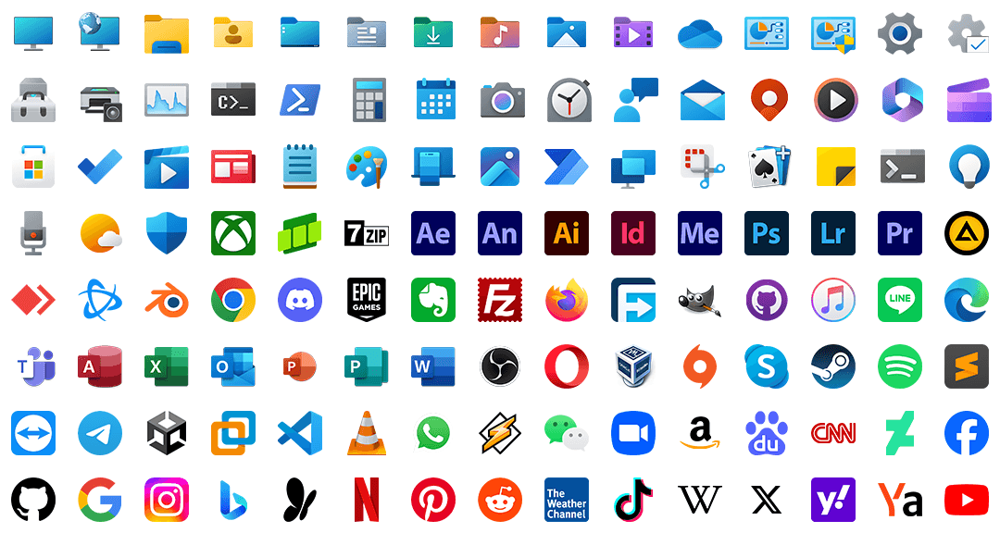

<!-- Turn off automatic wrapping, change the indentation method to Tab, and adjust the Tab Size to 8 to avoid typographical confusion. -->

	

		
		 
		一套基于 Rainmeter 的桌面自定义工具
	

	

		
		
		
		
		
		
		 
		<a href="https://www.patreon.com/posts/115660646">Join the discussion about upcoming Gamma version (Build 1100)!</a>
	

	

		本页的其他语言:
		<a href="/README.md">
			<kbd>English</kbd>
		</a>
	

# ¿Quanto? ¡Mucho!

<!-- ## 修修补补、齐齐整整 -->

<!-- ## 自定义，由你自己 -->

## 量大料足

Quanto Flx 附带 4 个预装包，其中包含**超过 400 种不同风格或尺寸的独特皮肤**！

### Quanto Flx 小工具

适合您日常使用的小工具。

| 图标																																													| 名称		| 描述				| 可用大小/风格										| 特色																							|
|-----------------------------------------------------------------------------------------------------------------------------------------------------------------------------------------------------------------------------------------------------------------------------------------------------------------------------------------------------------------------|---------------|-------------------------------|---------------------------------------------------------------------------------------|---------------------------------------------------------------------------------------------------------------------------------------------------------------------------------------|
| <picture>	<source srcset=".github/images/QuantoFlx.Gadgets/IconSquare/Calculator_0.png" media="(prefers-color-scheme: light)">	<source srcset=".github/images/QuantoFlx.Gadgets/IconSquare/Calculator_1.png" media="(prefers-color-scheme: dark)">		</picture>	| 计算器		| 简单的桌面计算器。			| `4x4` `4x5`										| 单击按钮时播放声音。																					|
| <picture>	<source srcset=".github/images/QuantoFlx.Gadgets/IconSquare/Calendar_0.png" media="(prefers-color-scheme: light)">	<source srcset=".github/images/QuantoFlx.Gadgets/IconSquare/Calendar_1.png" media="(prefers-color-scheme: dark)">		</picture>	| 日历		| 显示今天的日期，或者显示当月的日历。	| `2x2*2` `4x4`										| 是否从周一开始；可定制的事件列表。																				|
| <picture>	<source srcset=".github/images/QuantoFlx.Gadgets/IconSquare/Clock_0.png" media="(prefers-color-scheme: light)">		<source srcset=".github/images/QuantoFlx.Gadgets/IconSquare/Clock_1.png" media="(prefers-color-scheme: dark)">				</picture>	| 时钟		| 以数字或拟物的形式显示当前的时间。	| `2x1` `2x2` `4x2` `4x4`								| 文本对齐；显示或隐藏秒数或 AM/PM 指示器；是否将秒数显示为指针而不是圆圈；可定制的钟面等。最多可以同时存在 8 个克隆皮肤。												|
| <picture>	<source srcset=".github/images/QuantoFlx.Gadgets/IconSquare/Desktop_0.png" media="(prefers-color-scheme: light)">	<source srcset=".github/images/QuantoFlx.Gadgets/IconSquare/Desktop_1.png" media="(prefers-color-scheme: dark)">		</picture>	| 桌面		| 点击以显示或隐藏桌面上的皮肤。	| `1x1` 和自定义大小									| -																							|
| <picture>	<source srcset=".github/images/QuantoFlx.Gadgets/IconSquare/FolderViewer_0.png" media="(prefers-color-scheme: light)">	<source srcset=".github/images/QuantoFlx.Gadgets/IconSquare/FolderViewer_1.png" media="(prefers-color-scheme: dark)">		</picture>	| 文件夹查看器	| 显示文件夹中的内容。		| 列表、水平和垂直图标样式（类似 Dock）的可定制尺寸							| 一款皮肤可以同时显示任意本地路径的 4 到 32 个文件/文件夹。显示或隐藏文件或文件夹。最多可以同时存在 8 个克隆皮肤。												|
| <picture>	<source srcset=".github/images/QuantoFlx.Gadgets/IconSquare/Gallery_0.png" media="(prefers-color-scheme: light)">	<source srcset=".github/images/QuantoFlx.Gadgets/IconSquare/Gallery_1.png" media="(prefers-color-scheme: dark)">		</picture>	| 画廊		| 随机播放文件夹中的图片。		| 自定义大小										| -																							|
| <picture>	<source srcset=".github/images/QuantoFlx.Gadgets/IconSquare/MediaControl_0.png" media="(prefers-color-scheme: light)">	<source srcset=".github/images/QuantoFlx.Gadgets/IconSquare/MediaControl_1.png" media="(prefers-color-scheme: dark)">		</picture>	| 音乐播放控制	| 控制你的音乐播放器。		| `1x1` `2x1` `2x2` `4x1` `4x2*2` `4x4`							| 支持 `NowPlaying` Plugin [^1]支持的播放器，也适配 `WebNowPlaying` Plugin [^2]。														|
| <picture>	<source srcset=".github/images/QuantoFlx.Gadgets/IconSquare/RSS_0.png" media="(prefers-color-scheme: light)">		<source srcset=".github/images/QuantoFlx.Gadgets/IconSquare/RSS_1.png" media="(prefers-color-scheme: dark)">				</picture>	| RSS 源		| 从你的 RSS 源中关注最新资讯。	| 自定义大小										| 支持读取符合 Atom 规范的 RSS 源。一次可以读取 15/30 个标题。最多可以同时存在 8 个克隆皮肤。														|
| <picture>	<source srcset=".github/images/QuantoFlx.Gadgets/IconSquare/Search_0.png" media="(prefers-color-scheme: light)">	<source srcset=".github/images/QuantoFlx.Gadgets/IconSquare/Search_1.png" media="(prefers-color-scheme: dark)">				</picture>	| 搜索		| 简单的桌面搜索栏。			| 自定义大小										| 您可以选择百度、Google、微软必应、维基百科、雅虎或 Yandex 作为搜索引擎。																|
| <picture>	<source srcset=".github/images/QuantoFlx.Gadgets/IconSquare/Start_0.png" media="(prefers-color-scheme: light)">		<source srcset=".github/images/QuantoFlx.Gadgets/IconSquare/Start_1.png" media="(prefers-color-scheme: dark)">				</picture>	| 开始按钮		| 点击以显示开始菜单/屏幕。		| `1x1` `4x1` & 自定义大小									| 可定制的开始图标。																						|
| <picture>	<source srcset=".github/images/QuantoFlx.Gadgets/IconSquare/StickyNotes_0.png" media="(prefers-color-scheme: light)">	<source srcset=".github/images/QuantoFlx.Gadgets/IconSquare/StickyNotes_1.png" media="(prefers-color-scheme: dark)">		</picture>	| 便笺		| 用以记录的简单工具。		| 自定义大小										| 这些皮肤通过读取文本文件来实现其功能，并且还支持[文本格式化](https://github.com/stevehsudrawing/quantoflx/wiki/Manual-of-%22Quanto-Flx-Gadgets%22-Package#text-formatting)。最多可同时存在 16 个克隆皮肤。	|
| <picture>	<source srcset=".github/images/QuantoFlx.Gadgets/IconSquare/ToDoList_0.png" media="(prefers-color-scheme: light)">	<source srcset=".github/images/QuantoFlx.Gadgets/IconSquare/ToDoList_1.png" media="(prefers-color-scheme: dark)">		</picture>	| 待办列表		| 用以记录待办事件的实用工具。		| 自定义大小										| 最多可以同时存在 8 个克隆皮肤。																				|
| <picture>	<source srcset=".github/images/QuantoFlx.Gadgets/IconSquare/Weather_0.png" media="(prefers-color-scheme: light)">	<source srcset=".github/images/QuantoFlx.Gadgets/IconSquare/Weather_1.png" media="(prefers-color-scheme: dark)">		</picture>	| 天气		| 查看世界各地的天气。		| 当前/今天：`1x1` `2x2` `4x1` `4x2` `4x4` 每天/每小时：`2x2` `4x1` `4x2*2` `4x4*2` `8x4`	| 它分为四个部分：「当前」、「每日」、「每小时」和「今天」。无需 API 密钥。																|
| <picture>	<source srcset=".github/images/QuantoFlx.Gadgets/IconSquare/WorldClock_0.png" media="(prefers-color-scheme: light)">	<source srcset=".github/images/QuantoFlx.Gadgets/IconSquare/WorldClock_1.png" media="(prefers-color-scheme: dark)">		</picture>	| 世界时钟		| 查看世界各地的时间。		| `4x2` `4x4` `8x4`									| - 																							|

### Quanto Flx 杂项

这里有更多皮肤来装饰您的桌面。

| 图标																																														| 名称		| 描述					| 可用大小/风格			| 特色											|
|-------------------------------------------------------------------------------------------------------------------------------------------------------------------------------------------------------------------------------------------------------------------------------------------------------------------------------------------------------------------------------|---------------|---------------------------------------|-------------------------------|---------------------------------------------------------------------------------------|
| <picture>	<source srcset=".github/images/QuantoFlx.Misc/IconSquare/Background_0.png" media="(prefers-color-scheme: light)">		<source srcset=".github/images/QuantoFlx.Misc/IconSquare/Background_1.png" media="(prefers-color-scheme: dark)">		</picture>	| 背景		| 用以容纳面板。				| 全屏、固定宽度或高度或可定制尺寸	| 使用固定宽度或高度样式皮肤周围的「折叠」按钮将其用作侧边栏。最多可以同时存在 8 个克隆皮肤。			|
| <picture>	<source srcset=".github/images/QuantoFlx.Misc/IconSquare/ControlBar_0.png" media="(prefers-color-scheme: light)">		<source srcset=".github/images/QuantoFlx.Misc/IconSquare/ControlBar_1.png" media="(prefers-color-scheme: dark)">		</picture>	| 控制栏		| 于指掌间控制面板或系统。			| 垂直或水平			| 显示或隐藏用户图像图标或/和开始图标；两端可分别着色；可以设置背景颜色。					|
| <picture>	<source srcset=".github/images/QuantoFlx.Misc/IconSquare/BlankPanel_0.png" media="(prefers-color-scheme: light)">		<source srcset=".github/images/QuantoFlx.Misc/IconSquare/BlankPanel_1.png" media="(prefers-color-scheme: dark)">		</picture>	| 空面板		| 制作一个面板吧。				| 自定义大小			| 您可以编写自己的仪表/措施。最多可同时存在 16 个克隆皮肤。						|
| <picture>	<source srcset=".github/images/QuantoFlx.Misc/IconSquare/Customization_0.png" media="(prefers-color-scheme: light)">		<source srcset=".github/images/QuantoFlx.Misc/IconSquare/Customization_1.png" media="(prefers-color-scheme: dark)">		</picture>	| 自定义图片皮肤	| ｢贴｣ 张图片在桌面上。			| 自定义大小			| 可以用作快捷方式。最多可同时存在 16 个克隆皮肤。							|
| <picture>	<source srcset=".github/images/QuantoFlx.Misc/IconSquare/CustomText_0.png" media="(prefers-color-scheme: light)">		<source srcset=".github/images/QuantoFlx.Misc/IconSquare/CustomText_1.png" media="(prefers-color-scheme: dark)">		</picture>	| 自定义文字	| 为你的桌面加上几句溢美之词。			| 自定义大小			| 最多可同时存在 16 个克隆皮肤。								|
| <picture>	<source srcset=".github/images/QuantoFlx.Misc/IconSquare/DigitalClock_0.png" media="(prefers-color-scheme: light)">		<source srcset=".github/images/QuantoFlx.Misc/IconSquare/DigitalClock_1.png" media="(prefers-color-scheme: dark)">		</picture>	| 数字时钟		| 你可以使用完整的数字时钟，也可以自行组装一个。	| 自定义大小			| 该系列皮肤提供了足够的独立组件供用户定制数字时钟。您也可以直接使用集成数字时钟。				|
| <picture>	<source srcset=".github/images/QuantoFlx.Misc/IconSquare/DividingLine_0.png" media="(prefers-color-scheme: light)">		<source srcset=".github/images/QuantoFlx.Misc/IconSquare/DividingLine_1.png" media="(prefers-color-scheme: dark)">		</picture>	| 分隔线		| 分隔线。					| 自定义大小			| 最多可同时存在 16 个克隆皮肤。								|
| <picture>	<source srcset=".github/images/QuantoFlx.Misc/IconSquare/Ruler_0.png" media="(prefers-color-scheme: light)">			<source srcset=".github/images/QuantoFlx.Misc/IconSquare/Ruler_1.png" media="(prefers-color-scheme: dark)">				</picture>	| 尺子		| 协助用户放置皮肤的工具。			| 自定义大小			| 这些皮肤利用 Rainmeter 的自动皮肤对齐功能来帮助用户放置皮肤。最多可以同时存在 4 个克隆皮肤。		|
| <picture>	<source srcset=".github/images/QuantoFlx.Misc/IconSquare/SkeuomorphicClock_0.png" media="(prefers-color-scheme: light)">	<source srcset=".github/images/QuantoFlx.Misc/IconSquare/SkeuomorphicClock_1.png" media="(prefers-color-scheme: dark)">		</picture>	| 拟物时钟		| 桌面拟物时钟。				| 自定义大小			| 显示或隐藏秒数或 AM/PM 指示器；是否将秒数显示为指针而不是圆圈；可定制的钟面；Aero 背景[^3]等。		|
| <picture>	<source srcset=".github/images/QuantoFlx.Misc/IconSquare/TextOptions_0.png" media="(prefers-color-scheme: light)">		<source srcset=".github/images/QuantoFlx.Misc/IconSquare/TextOptions_1.png" media="(prefers-color-scheme: dark)">		</picture>	| 文字选项		| 可自定义的快捷方式或超链接。			| 自定义大小			| 一款皮肤可以同时显示 4 个条目。最多可以同时存在 8 个克隆皮肤。					|
| <picture>	<source srcset=".github/images/QuantoFlx.Misc/IconSquare/Visualiser_0.png" media="(prefers-color-scheme: light)">		<source srcset=".github/images/QuantoFlx.Misc/IconSquare/Visualiser_1.png" media="(prefers-color-scheme: dark)">		</picture>	| 可视化器（频谱）	| 让音乐踊动于屏幕上。			| 水平、垂直、放射状 4 种样式		| 您可以自定义宽度和高度或半径，并设置水平或垂直样式的反射。可视化工具的外观也可以翻转。			|

### Quanto Flx 快捷方式

使用 Quanto Flx 的风格来显示快捷方式。

该软件包附带 260 个预设快捷方式，最多可设置 240 个自定义快捷方式。

	<picture>
		<source media="(prefers-color-scheme: light)" srcset=".github/images/QuantoFlx.Shortcuts/Images/Overview_0.png">
		<source media="(prefers-color-scheme: dark)" srcset=".github/images/QuantoFlx.Shortcuts/Images/Overview_1.png">
		
	</picture>

快捷方式皮肤的样式有`1x1`、`2x2`、`4x1`、`4x2`。

### Quanto Flx 系统实用工具

这些皮肤依靠系统监控软件（例如 AIDA 或 HWiNFO）来提供有关系统资源使用情况的统一且详细的报告。

[配置您的系统性能监控软件](https://github.com/stevehsudrawing/quantoflx/wiki/Manual-of-%22Quanto-Flx-System%22-Package#before-you-use-them)以获得更多功能。

| 图标																																																| 名称			| 描述					| 可用大小/风格				| 特色										|
|-----------------------------------------------------------------------------------------------------------------------------------------------------------------------------------------------------------------------------------------------------------------------------------------------------------------------------------------------------------------------------------------------|-----------------------|---------------------------------------|---------------------------------------|-------------------------------------------------------------------------------|
| <picture>	<source srcset=".github/images/QuantoFlx.System/IconSquare/Battery_0.png" media="(prefers-color-scheme: light)">		<source srcset=".github/images/QuantoFlx.System/IconSquare/Battery_1.png" media="(prefers-color-scheme: dark)">						</picture>	| 电池			| 显示当前的电池状态。			| `1x1` `2x2` `4x1` `4x2` `Details*2`	| 通用系统监控皮肤之一。								|
| <picture>	<source srcset=".github/images/QuantoFlx.System/IconSquare/CoolingFans_0.png" media="(prefers-color-scheme: light)">		<source srcset=".github/images/QuantoFlx.System/IconSquare/CoolingFans_1.png" media="(prefers-color-scheme: dark)">				</picture>	| 冷却风扇			| 显示当前的冷却风扇的速度。			| `1x1` `2x2` `4x1`			| 通用系统监控皮肤之一。最多可以同时存在 8 个克隆皮肤。					|
| <picture>	<source srcset=".github/images/QuantoFlx.System/IconSquare/Customization_0.png" media="(prefers-color-scheme: light)">		<source srcset=".github/images/QuantoFlx.System/IconSquare/Customization_1.png" media="(prefers-color-scheme: dark)">				</picture>	| 自定义系统性能监控皮肤	| 若有能力，可以自行定义性能监控。		| `1x1` `2x2` `4x1` `4x2` `Details*2`	| 通用系统监控皮肤之一。您可以修改此皮肤的参数或添加 Measures。最多可同时存在 16 个克隆皮肤。	|
| <picture>	<source srcset=".github/images/QuantoFlx.System/IconSquare/CPU_0.png" media="(prefers-color-scheme: light)">			<source srcset=".github/images/QuantoFlx.System/IconSquare/CPU_1.png" media="(prefers-color-scheme: dark)">						</picture>	| 中央处理器		| 显示当前 CPU 的使用情况以及状态。		| `1x1` `2x2` `4x1` `4x2` `Details*2`	| 通用系统监控皮肤之一。								|
| <picture>	<source srcset=".github/images/QuantoFlx.System/IconSquare/CPUProcessors_0.png" media="(prefers-color-scheme: light)">		<source srcset=".github/images/QuantoFlx.System/IconSquare/CPUProcessors_1.png" media="(prefers-color-scheme: dark)">				</picture>	| CPU 各核心		| 显示当前 CPU 各核心的使用情况以及状态。	| 自适应					| 通用系统监控皮肤之一。								|
| <picture>	<source srcset=".github/images/QuantoFlx.System/IconSquare/GPU_0.png" media="(prefers-color-scheme: light)">			<source srcset=".github/images/QuantoFlx.System/IconSquare/GPU_1.png" media="(prefers-color-scheme: dark)">						</picture>	| 图形处理器		| 显示当前 GPU 的使用情况以及状态。		| `1x1` `2x2` `4x1` `4x2` `Details*2`	| 通用系统监控皮肤之一。最多可以同时存在 8 个克隆皮肤。					|
| <picture>	<source srcset=".github/images/QuantoFlx.System/IconSquare/Drives_0.png" media="(prefers-color-scheme: light)">			<source srcset=".github/images/QuantoFlx.System/IconSquare/Drives_1.png" media="(prefers-color-scheme: dark)">						</picture>	| 逻辑驱动器		| 显示当前各个驱动器的占用情况以及状态。		| `1x1` `2x2` `4x1` `4x2` `Details`	| 通用系统监控皮肤之一。最多可以同时存在 26 个克隆皮肤。					|
| <picture>	<source srcset=".github/images/QuantoFlx.System/IconSquare/Network_0.png" media="(prefers-color-scheme: light)">		<source srcset=".github/images/QuantoFlx.System/IconSquare/Network_1.png" media="(prefers-color-scheme: dark)">						</picture>	| 网络			| 显示当前的网络流量以及联网详情。		| `1x1` `2x2` `4x1` `4x2` `Details*2`	| 通用系统监控皮肤之一。								|
| <picture>	<source srcset=".github/images/QuantoFlx.System/IconSquare/PhysicalDrives_0.png" media="(prefers-color-scheme: light)">		<source srcset=".github/images/QuantoFlx.System/IconSquare/PhysicalDrives_1.png" media="(prefers-color-scheme: dark)">				</picture>	| 物理驱动器		| 显示当前物理驱动器的状态。			| `1x1` `2x2` `4x1` `4x2` `Details*2`	| 通用系统监控皮肤之一。最多可以同时存在 8 个克隆皮肤。					|
| <picture>	<source srcset=".github/images/QuantoFlx.System/IconSquare/RAM_0.png" media="(prefers-color-scheme: light)">			<source srcset=".github/images/QuantoFlx.System/IconSquare/RAM_1.png" media="(prefers-color-scheme: dark)">						</picture>	| 内部存储器（运行内存）	| 显示当前 RAM 的使用情况。			| `1x1` `2x2` `4x1` `4x2` `Details*2`	| 通用系统监控皮肤之一。								|
| <picture>	<source srcset=".github/images/QuantoFlx.System/IconSquare/RecycleBin_0.png" media="(prefers-color-scheme: light)">		<source srcset=".github/images/QuantoFlx.System/IconSquare/RecycleBin_1.png" media="(prefers-color-scheme: dark)">				</picture>	| 回收站			| 与桌面上的 ｢回收站｣ 图标作用相同的皮肤。	| `1x1` `4x1` 和自定义尺寸			| 将文件拖到此皮肤中即可将其删除。您可以自定义该皮肤在不同情况下显示的图标。			|
| <picture>	<source srcset=".github/images/QuantoFlx.System/IconSquare/ScreenBrightness_0.png" media="(prefers-color-scheme: light)">	<source srcset=".github/images/QuantoFlx.System/IconSquare/ScreenBrightness_1.png" media="(prefers-color-scheme: dark)">		</picture>	| 屏幕亮度			| 调整屏幕亮度的皮肤。			| `4x1` `4x2`				| 该皮肤仅适用于可以调节亮度的屏幕。							|
| <picture>	<source srcset=".github/images/QuantoFlx.System/IconSquare/System_0.png" media="(prefers-color-scheme: light)">			<source srcset=".github/images/QuantoFlx.System/IconSquare/System_1.png" media="(prefers-color-scheme: dark)">						</picture>	| 系统			| 显示当前系统的运行状态。			| `4x1` `Details`			| 通用系统监控皮肤之一。您可以快速复制您的电脑信息。						|
| <picture>	<source srcset=".github/images/QuantoFlx.System/IconSquare/TopProcess_0.png" media="(prefers-color-scheme: light)">		<source srcset=".github/images/QuantoFlx.System/IconSquare/TopProcess_1.png" media="(prefers-color-scheme: dark)">				</picture>	| 占用最高进程		| 显示占用最消耗资源的进程。			| 自定义尺寸				| 最多可以同时存在 4 个克隆皮肤（CPU、GPU、I/O、RAM）。					|
| <picture>	<source srcset=".github/images/QuantoFlx.System/IconSquare/VideoMemory_0.png" media="(prefers-color-scheme: light)">		<source srcset=".github/images/QuantoFlx.System/IconSquare/VideoMemory_1.png" media="(prefers-color-scheme: dark)">				</picture>	| 视频运存			| 显示当前视频运存的占用情况。			| `1x1` `2x2` `4x1` `4x2`		| 通用系统监控皮肤之一。								|
| <picture>	<source srcset=".github/images/QuantoFlx.System/IconSquare/Volume_0.png" media="(prefers-color-scheme: light)">			<source srcset=".github/images/QuantoFlx.System/IconSquare/Volume_1.png" media="(prefers-color-scheme: dark)">						</picture>	| 音量			| 调整整体音量以及各应用程序的音量。		| `4x1` 和自定义尺寸			| 用于调整全局音量或每个应用程序音量的选项。						|

## 多语言支持

Quanto Flx 目前支持以下语言：

| 语言代码		| 语言名称		| 贡献者		|
|---------------|---------------|---------------|
| `en-us`	| English	| Steve Hsu	|
| `zh-hans`	| 中文 (简体)	| Steve Hsu	|
| `zh-hant`	| 中文 (繁體)	| Steve Hsu	|

随时欢迎您的贡献！如果您想贡献翻译，请阅读[本文档](Skins/QuantoFlx/%40Resources/Config/Language/README.md)。

# 如何安装

> [!WARNING]
> 请注意，目前 Quanto Flx 处于**早期测试版**，所有功能可能随时更改。

## 自动安装

1. 下载并安装最新版本的 [Rainmeter](https://www.rainmeter.net/)。

2. 前往[发布页面](https://github.com/stevehsudrawing/quantoflx/releases)下载最新版本的 Quanto Flx 安装包。

3. 单击「安装」，然后按照提示进行初始化即可。[这篇文章](https://github.com/stevehsudrawing/quantoflx/wiki/Guide-for-New-Users)可能对您有帮助。

4. 享用吧！

## 手动安装

首先，您需要[安装最新版本的 Rainmeter](https://www.rainmeter.net/)。

然后[在此处下载 Quanto Flx](https://github.com/stevehsudrawing/quantoflx/archive/refs/heads/main.zip) 并手动安装/更新：

- 下面列出了需要安装的 Plugin。您可以在 `%APPDATA%\Rainmeter\Plugins` 中查看已安装的 Plugin。如果您的设备上不存在其中某些 Plugin，请单击超链接并下载最新版本。

| Plugin								| Plugin								| Plugin								| Plugin								|
|-----------------------------------------------------------------------|-----------------------------------------------------------------------|-----------------------------------------------------------------------|-----------------------------------------------------------------------|
| [AppVolume](https://github.com/khanhas/AppVolumePlugin)		| [Backlight](https://forum.rainmeter.net/viewtopic.php?p=103782)	| [Chameleon](https://github.com/socks-the-fox/chameleon)		| [ConfigActive](https://github.com/jsmorley/ConfigActive)		|
| [FileChoose](https://forum.rainmeter.net/viewtopic.php?p=167079)	| [FrostedGlass](https://github.com/TheAzack9/FrostedGlass)		| [HotKey](https://github.com/brianferguson/HotKey.dll)			| [Mouse](https://github.com/NighthawkSLO/Mouse.dll)			|
| [SysColor](https://github.com/brianferguson/SysColor.dll)		| [TrayIcon](https://github.com/deathcrafter/PluginTrayIcon)		| [WebNowPlaying](https://github.com/keifufu/WebNowPlaying-Rainmeter)	|									|

- 将`Skins`文件夹中的`QuantoFlx`文件夹复制/解压（并覆盖）到`%HOMEPATH%\Documents\Rainmeter\Skins`。

- 将`Layouts`文件夹中的`QuantoFlx`和`QuantoFlx_Setup`文件夹复制/解压缩（并覆盖）到`%APPDATA%\Rainmeter\Layouts`。

最后，刷新或重新启动 Rainmeter 并在 Rainmeter 管理器的布局页面中加载`QuantoFlx_Setup`布局。享用吧！

> [!TIP]
> 如果您想先睹为快，请查看[`snapshot`分支](https://github.com/stevehsudrawing/quantoflx/tree/snapshot)。

# 特别鸣谢

| 作者		| 提供										| 提供										|
|---------------|-------------------------------------------------------------------------------|-------------------------------------------------------------------------------|
| Brian		| [HotKey Plugin](https://github.com/brianferguson/HotKey.dll)			| [SysColor Plugin](https://github.com/brianferguson/SysColor.dll/)		|
| Cfixd		| [Backlight Plugin](https://forum.rainmeter.net/viewtopic.php?p=103782)	|										|
| Death.crafter	| [TrayIcon Plugin](https://github.com/deathcrafter/PluginTrayIcon)		|										|
| JSMorley	| [ConfigActive Plugin](https://github.com/jsmorley/ConfigActive)		| [RainRGB4](https://forum.rainmeter.net/viewtopic.php?t=6215)			|
| Khanhas	| [AppVolume Plugin](https://github.com/khanhas/AppVolumePlugin)		|										|
| NighthawkSLO	| [Mouse Plugin](https://github.com/NighthawkSLO/Mouse.dll/)			|										|
| Setsukka	| [FileChoose Plugin](https://forum.rainmeter.net/viewtopic.php?p=167079)	|										|
| Smurfier	| [LuaCalendar](https://forum.rainmeter.net/viewtopic.php?p=63288)		|										|
| Socks the Fox	| [Chameleon Plugin](https://github.com/socks-the-fox/chameleon)		|										|
| TheAzack9	| [FrostedGlass Plugin](https://github.com/TheAzack9/FrostedGlass)		|										|
| Tjhrulz	| [WebNowPlaying Plugin](https://github.com/keifufu/WebNowPlaying-Rainmeter)	|										|

[^1]: AIMP、foobar2000、iTunes、J. River Media Center、Media Jukebox、MusicBee、Winamp 和旧版 Windows Media Player。
[^2]: 使用 Windows 10/11 时，您可以使用此 Plugin 连接到一些受支持的[桌面音乐播放器](https://github.com/ModernFlyouts-Community/ModernFlyouts/blob/main/docs/GSMTC-Support-And-Popular-Apps.md)或[基于浏览器的播放器](https://wnp.keifufu.dev/supported-sites)（需要先安装[浏览器扩展](https://wnp.keifufu.dev/quickstart#install-the-browser-extension)）。
[^3]: 仅适用于 Windows 7。