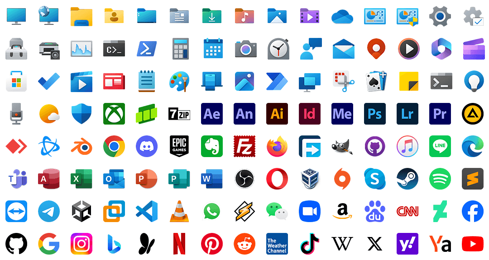

<!-- Turn off word wrap, change the indentation method to Tab, and adjust the Tab Size to 8 to avoid typographical confusion. -->

	

		
		 
		一套基于 Rainmeter 的桌面自定义工具
	

	

		
		
		
		
		
		
		 
		<a href="https://www.patreon.com/posts/119206461"><kbd>Quanto Flx 2.00 Delta (构建 1101) 的更新日志</kbd></a> 
		<!-- <a href="https://www.patreon.com/posts/119206461"><kbd>Learn about the latest news of upcoming Delta (Build 1101)</kbd></a>  -->
	

	

		<a href="/README.md">English</a> | 中文 (简体)
	

# ¿Quanto? ¡Mucho!

<!-- ## 修修补补、齐齐整整 -->

## 量大料足

Quanto Flx 附带 4 个预装封包，其中包含 **160+ 个具有各种风格和尺寸的独特面板、260 个带有可自定义图标和横幅的预设快捷方式以及 80+ 个其他高度可自定义的组件**！

### Quanto Flx 小工具

适合您日常使用的小工具。

| 图标																																													| 名称		| 描述				| 可用大小/风格																					| 特色																										|
|-----------------------------------------------------------------------------------------------------------------------------------------------------------------------------------------------------------------------------------------------------------------------------------------------------------------------------------------------------------------------|---------------|-------------------------------|-------------------------------------------------------------------------------------------------------------------------------------------------------------------------------|---------------------------------------------------------------------------------------------------------------------------------------------------------------------------------------------------------------|
| <picture>	<source srcset=".github/images/QuantoFlx.Gadgets/IconSquare/Calculator_0.png" media="(prefers-color-scheme: light)">	<source srcset=".github/images/QuantoFlx.Gadgets/IconSquare/Calculator_1.png" media="(prefers-color-scheme: dark)">		</picture>	| 计算器		| 简单的桌面计算器。			| `4x4` `4x5`																					| 单击按钮时播放声音。																								|
| <picture>	<source srcset=".github/images/QuantoFlx.Gadgets/IconSquare/Calendar_0.png" media="(prefers-color-scheme: light)">	<source srcset=".github/images/QuantoFlx.Gadgets/IconSquare/Calendar_1.png" media="(prefers-color-scheme: dark)">		</picture>	| 日历		| 显示今天的日期，或者显示当月的日历。	| `2x2*2` `4x4`																					| 是否从周一开始；可定制的事件列表。																							|
| <picture>	<source srcset=".github/images/QuantoFlx.Gadgets/IconSquare/Clock_0.png" media="(prefers-color-scheme: light)">		<source srcset=".github/images/QuantoFlx.Gadgets/IconSquare/Clock_1.png" media="(prefers-color-scheme: dark)">				</picture>	| 时钟		| 以数字或拟物的形式显示当前的时间。	| `2x1` `2x2` `4x2` `4x4`																			| 文本对齐；显示或隐藏秒数或上午/下午指示器；是否将秒数显示为指针而不是圆圈；可定制的钟面等。最多可以同时存在 8 个克隆皮肤。															|
| <picture>	<source srcset=".github/images/QuantoFlx.Gadgets/IconSquare/Desktop_0.png" media="(prefers-color-scheme: light)">	<source srcset=".github/images/QuantoFlx.Gadgets/IconSquare/Desktop_1.png" media="(prefers-color-scheme: dark)">		</picture>	| 桌面		| 点击以显示或隐藏桌面上的皮肤。	| `1x1` 和自定义大小																				| 可以像窗口一样缩放大小。																								|
| <picture>	<source srcset=".github/images/QuantoFlx.Gadgets/IconSquare/FolderViewer_0.png" media="(prefers-color-scheme: light)">	<source srcset=".github/images/QuantoFlx.Gadgets/IconSquare/FolderViewer_1.png" media="(prefers-color-scheme: dark)">		</picture>	| 文件夹查看器	| 显示文件夹中的内容。		| 列表、水平和垂直图标样式（类似程序坞）的可定制尺寸																		| 一款皮肤可以同时显示任意本地路径的 4 到 32 个文件/文件夹。显示或隐藏文件或文件夹。可以像窗口一样缩放大小。最多可以同时存在 8 个克隆皮肤。													|
| <picture>	<source srcset=".github/images/QuantoFlx.Gadgets/IconSquare/Gallery_0.png" media="(prefers-color-scheme: light)">	<source srcset=".github/images/QuantoFlx.Gadgets/IconSquare/Gallery_1.png" media="(prefers-color-scheme: dark)">		</picture>	| 画廊		| 随机播放文件夹中的图片。		| 自定义大小																					| 可以像窗口一样缩放大小。																								|
| <picture>	<source srcset=".github/images/QuantoFlx.Gadgets/IconSquare/MediaControl_0.png" media="(prefers-color-scheme: light)">	<source srcset=".github/images/QuantoFlx.Gadgets/IconSquare/MediaControl_1.png" media="(prefers-color-scheme: dark)">		</picture>	| 音乐播放控制	| 控制你的音乐播放器。		| `1x1` `2x1` `2x2` `4x1` `4x2*2` `4x4`																		| 支持`NowPlaying`插件[^1]支持的播放器，也适配`WebNowPlaying`插件[^2]。																			|
| <picture>	<source srcset=".github/images/QuantoFlx.Gadgets/IconSquare/RSS_0.png" media="(prefers-color-scheme: light)">		<source srcset=".github/images/QuantoFlx.Gadgets/IconSquare/RSS_1.png" media="(prefers-color-scheme: dark)">				</picture>	| RSS 源		| 从你的 RSS 源中关注最新资讯。	| 自定义大小																					| 支持读取符合 Atom 规范的 RSS 源。一次可以读取 15/30 个标题。可以像窗口一样缩放大小。最多可以同时存在 8 个克隆皮肤。															|
| <picture>	<source srcset=".github/images/QuantoFlx.Gadgets/IconSquare/Search_0.png" media="(prefers-color-scheme: light)">	<source srcset=".github/images/QuantoFlx.Gadgets/IconSquare/Search_1.png" media="(prefers-color-scheme: dark)">				</picture>	| 搜索		| 简单的桌面搜索栏。			| 自定义大小																					| 您可以选择百度、Google、微软必应、维基百科、雅虎或 Yandex 作为搜索引擎。可以像窗口一样缩放大小。																	|
| <picture>	<source srcset=".github/images/QuantoFlx.Gadgets/IconSquare/Start_0.png" media="(prefers-color-scheme: light)">		<source srcset=".github/images/QuantoFlx.Gadgets/IconSquare/Start_1.png" media="(prefers-color-scheme: dark)">				</picture>	| 开始按钮		| 点击以显示开始菜单/屏幕。		| `1x1` `4x1` & 自定义大小																				| 可定制的开始图标。	可以像窗口一样缩放大小。																						|
| <picture>	<source srcset=".github/images/QuantoFlx.Gadgets/IconSquare/StickyNotes_0.png" media="(prefers-color-scheme: light)">	<source srcset=".github/images/QuantoFlx.Gadgets/IconSquare/StickyNotes_1.png" media="(prefers-color-scheme: dark)">		</picture>	| 便笺		| 用以记录的简单工具。		| 自定义大小																					| 这些皮肤通过读取文本文件来实现其功能，并且还支持[文本格式化](https://github.com/stevehsudrawing/quantoflx/wiki/Manual-of-%22Quanto-Flx-Gadgets%22-Package#text-formatting)。可以像窗口一样缩放大小。最多可同时存在 16 个克隆皮肤。	|
| <picture>	<source srcset=".github/images/QuantoFlx.Gadgets/IconSquare/ToDoList_0.png" media="(prefers-color-scheme: light)">	<source srcset=".github/images/QuantoFlx.Gadgets/IconSquare/ToDoList_1.png" media="(prefers-color-scheme: dark)">		</picture>	| 待办列表		| 用以记录待办事件的实用工具。		| 自定义大小																					| 最多可以同时存在 8 个克隆皮肤。可以像窗口一样缩放大小。																					|
| <picture>	<source srcset=".github/images/QuantoFlx.Gadgets/IconSquare/Weather_0.png" media="(prefers-color-scheme: light)">	<source srcset=".github/images/QuantoFlx.Gadgets/IconSquare/Weather_1.png" media="(prefers-color-scheme: dark)">		</picture>	| 天气		| 查看世界各地的天气。		| 当前/今天：`1x1` `2x2` `4x1` `4x2` `4x4` 每天/每小时：`2x2` `4x1` `4x2*2` `4x4*2` `8x4` 空气质量/穿着建议/云量/降雨或降雪/日照时间/紫外线/能见度/风: `1x1` `2x2` `4x1` `4x2` `6x2` `8x2`	| 如「可用大小/风格」所示，此小工具分为几个部分，可供自由组合。无需 API 密钥。																			|
| <picture>	<source srcset=".github/images/QuantoFlx.Gadgets/IconSquare/WorldClock_0.png" media="(prefers-color-scheme: light)">	<source srcset=".github/images/QuantoFlx.Gadgets/IconSquare/WorldClock_1.png" media="(prefers-color-scheme: dark)">		</picture>	| 世界时钟		| 查看世界各地的时间。		| `4x2` `8x4`																					| - 																										|

### Quanto Flx 杂项

这里有更多皮肤来装饰您的桌面。

| 图标																																														| 名称		| 描述					| 可用大小/风格			| 特色												|
|-------------------------------------------------------------------------------------------------------------------------------------------------------------------------------------------------------------------------------------------------------------------------------------------------------------------------------------------------------------------------------|---------------|---------------------------------------|-------------------------------|-----------------------------------------------------------------------------------------------|
| <picture>	<source srcset=".github/images/QuantoFlx.Misc/IconSquare/Background_0.png" media="(prefers-color-scheme: light)">		<source srcset=".github/images/QuantoFlx.Misc/IconSquare/Background_1.png" media="(prefers-color-scheme: dark)">		</picture>	| 背景		| 用以容纳面板。				| 全屏、固定宽度或高度或可定制尺寸	| 使用固定宽度或高度样式皮肤周围的「折叠」按钮将其用作侧边栏。可以像窗口一样缩放大小。最多可以同时存在 8 个克隆皮肤。	|
| <picture>	<source srcset=".github/images/QuantoFlx.Misc/IconSquare/ControlBar_0.png" media="(prefers-color-scheme: light)">		<source srcset=".github/images/QuantoFlx.Misc/IconSquare/ControlBar_1.png" media="(prefers-color-scheme: dark)">		</picture>	| 控制栏		| 于指掌间控制面板或系统。			| 垂直或水平			| 显示或隐藏用户图像图标或/和开始图标；两端可分别着色；可以设置背景颜色。						|
| <picture>	<source srcset=".github/images/QuantoFlx.Misc/IconSquare/BlankPanel_0.png" media="(prefers-color-scheme: light)">		<source srcset=".github/images/QuantoFlx.Misc/IconSquare/BlankPanel_1.png" media="(prefers-color-scheme: dark)">		</picture>	| 空面板		| 制作一个面板吧。				| 自定义大小			| 您可以编写自己的 Meters 或计量。可以像窗口一样缩放大小。最多可同时存在 16 个克隆皮肤。				|
| <picture>	<source srcset=".github/images/QuantoFlx.Misc/IconSquare/Customization_0.png" media="(prefers-color-scheme: light)">		<source srcset=".github/images/QuantoFlx.Misc/IconSquare/Customization_1.png" media="(prefers-color-scheme: dark)">		</picture>	| 自定义图片皮肤	| ｢贴｣ 张图片在桌面上。			| 自定义大小			| 可以用作快捷方式。可以像窗口一样缩放大小。最多可同时存在 16 个克隆皮肤。					|
| <picture>	<source srcset=".github/images/QuantoFlx.Misc/IconSquare/CustomText_0.png" media="(prefers-color-scheme: light)">		<source srcset=".github/images/QuantoFlx.Misc/IconSquare/CustomText_1.png" media="(prefers-color-scheme: dark)">		</picture>	| 自定义文字	| 为你的桌面加上几句溢美之词。			| 自定义大小			| 最多可同时存在 16 个克隆皮肤。									|
| <picture>	<source srcset=".github/images/QuantoFlx.Misc/IconSquare/DigitalClock_0.png" media="(prefers-color-scheme: light)">		<source srcset=".github/images/QuantoFlx.Misc/IconSquare/DigitalClock_1.png" media="(prefers-color-scheme: dark)">		</picture>	| 数字时钟		| 你可以使用完整的数字时钟，也可以自行组装一个。	| 自定义大小			| 该系列皮肤提供了足够的独立组件供用户定制数字时钟。您也可以直接使用集成数字时钟。					|
| <picture>	<source srcset=".github/images/QuantoFlx.Misc/IconSquare/DividingLine_0.png" media="(prefers-color-scheme: light)">		<source srcset=".github/images/QuantoFlx.Misc/IconSquare/DividingLine_1.png" media="(prefers-color-scheme: dark)">		</picture>	| 分隔线		| 分隔线。					| 自定义大小			| 可以像窗口一样缩放大小。最多可同时存在 16 个克隆皮肤。							|
| <picture>	<source srcset=".github/images/QuantoFlx.Misc/IconSquare/Ruler_0.png" media="(prefers-color-scheme: light)">			<source srcset=".github/images/QuantoFlx.Misc/IconSquare/Ruler_1.png" media="(prefers-color-scheme: dark)">				</picture>	| 尺子		| 协助用户放置皮肤的工具。			| 自定义大小			| 这些皮肤利用 Rainmeter 的自动皮肤对齐功能来帮助用户放置皮肤。可以像窗口一样缩放大小。最多可以同时存在 4 个克隆皮肤。	|
| <picture>	<source srcset=".github/images/QuantoFlx.Misc/IconSquare/SkeuomorphicClock_0.png" media="(prefers-color-scheme: light)">	<source srcset=".github/images/QuantoFlx.Misc/IconSquare/SkeuomorphicClock_1.png" media="(prefers-color-scheme: dark)">		</picture>	| 拟物时钟		| 桌面拟物时钟。				| 自定义大小			| 显示或隐藏秒数或上午/下午指示器；是否将秒数显示为指针而不是圆圈；可定制的钟面；Aero 背景[^3]等。			|
| <picture>	<source srcset=".github/images/QuantoFlx.Misc/IconSquare/TextOptions_0.png" media="(prefers-color-scheme: light)">		<source srcset=".github/images/QuantoFlx.Misc/IconSquare/TextOptions_1.png" media="(prefers-color-scheme: dark)">		</picture>	| 文字选项		| 可自定义的快捷方式或超链接。			| 自定义大小			| 一款皮肤可以同时显示 4 个条目。最多可以同时存在 8 个克隆皮肤。						|
| <picture>	<source srcset=".github/images/QuantoFlx.Misc/IconSquare/Visualiser_0.png" media="(prefers-color-scheme: light)">		<source srcset=".github/images/QuantoFlx.Misc/IconSquare/Visualiser_1.png" media="(prefers-color-scheme: dark)">		</picture>	| 可视化器（频谱）	| 让音乐踊动于屏幕上。			| 水平、垂直、放射状 4 种样式		| 您可以自定义宽度和高度或半径，并设置水平或垂直样式的镜像。可视化器的外观也可以翻转。				|

### Quanto Flx 快捷方式

使用 Quanto Flx 的风格来显示快捷方式。

该封包附带 260 个预设快捷方式，最多可设置 240 个自定义快捷方式。

	<picture>
		<source media="(prefers-color-scheme: light)" srcset=".github/images/QuantoFlx.Shortcuts/Images/Overview_0.png">
		<source media="(prefers-color-scheme: dark)" srcset=".github/images/QuantoFlx.Shortcuts/Images/Overview_1.png">
		
	</picture>

快捷方式皮肤的样式有`1x1`、`2x2`、`4x1`、`4x2`。

### Quanto Flx 系统实用工具

这些皮肤依靠系统监控软件（例如 AIDA 或 HWiNFO）来提供有关系统资源使用情况的统一且详细的报告。

[配置您的系统性能监控软件](https://github.com/stevehsudrawing/quantoflx/wiki/Manual-of-''Quanto-Flx-System''-Package#before-you-use-them)以获得更多功能。

| 图标																																																| 名称			| 描述					| 可用大小/风格				| 特色										|
|-----------------------------------------------------------------------------------------------------------------------------------------------------------------------------------------------------------------------------------------------------------------------------------------------------------------------------------------------------------------------------------------------|-----------------------|---------------------------------------|---------------------------------------|-------------------------------------------------------------------------------|
| <picture>	<source srcset=".github/images/QuantoFlx.System/IconSquare/Battery_0.png" media="(prefers-color-scheme: light)">		<source srcset=".github/images/QuantoFlx.System/IconSquare/Battery_1.png" media="(prefers-color-scheme: dark)">						</picture>	| 电池			| 显示当前的电池状态。			| `1x1` `2x2` `4x1` `4x2` `Details*2`	| 通用系统监控皮肤之一。								|
| <picture>	<source srcset=".github/images/QuantoFlx.System/IconSquare/CoolingFans_0.png" media="(prefers-color-scheme: light)">		<source srcset=".github/images/QuantoFlx.System/IconSquare/CoolingFans_1.png" media="(prefers-color-scheme: dark)">				</picture>	| 冷却风扇			| 显示当前的冷却风扇的速度。			| `1x1` `2x2` `4x1`			| 通用系统监控皮肤之一。最多可以同时存在 8 个克隆皮肤。					|
| <picture>	<source srcset=".github/images/QuantoFlx.System/IconSquare/Customization_0.png" media="(prefers-color-scheme: light)">		<source srcset=".github/images/QuantoFlx.System/IconSquare/Customization_1.png" media="(prefers-color-scheme: dark)">				</picture>	| 自定义系统性能监控皮肤	| 若有能力，可以自行定义性能监控。		| `1x1` `2x2` `4x1` `4x2` `Details*2`	| 通用系统监控皮肤之一。您可以修改此皮肤的参数或添加 Measures。最多可同时存在 16 个克隆皮肤。	|
| <picture>	<source srcset=".github/images/QuantoFlx.System/IconSquare/CPU_0.png" media="(prefers-color-scheme: light)">			<source srcset=".github/images/QuantoFlx.System/IconSquare/CPU_1.png" media="(prefers-color-scheme: dark)">						</picture>	| 中央处理器		| 显示当前 CPU 的使用情况以及状态。		| `1x1` `2x2` `4x1` `4x2` `Details*2`	| 通用系统监控皮肤之一。								|
| <picture>	<source srcset=".github/images/QuantoFlx.System/IconSquare/CPUProcessors_0.png" media="(prefers-color-scheme: light)">		<source srcset=".github/images/QuantoFlx.System/IconSquare/CPUProcessors_1.png" media="(prefers-color-scheme: dark)">				</picture>	| CPU 各核心		| 显示当前 CPU 各核心的使用情况以及状态。	| 自适应					| -										|
| <picture>	<source srcset=".github/images/QuantoFlx.System/IconSquare/GPU_0.png" media="(prefers-color-scheme: light)">			<source srcset=".github/images/QuantoFlx.System/IconSquare/GPU_1.png" media="(prefers-color-scheme: dark)">						</picture>	| 图形处理器		| 显示当前 GPU 的使用情况以及状态。		| `1x1` `2x2` `4x1` `4x2` `Details*2`	| 通用系统监控皮肤之一。最多可以同时存在 8 个克隆皮肤。					|
| <picture>	<source srcset=".github/images/QuantoFlx.System/IconSquare/Drives_0.png" media="(prefers-color-scheme: light)">			<source srcset=".github/images/QuantoFlx.System/IconSquare/Drives_1.png" media="(prefers-color-scheme: dark)">						</picture>	| 逻辑驱动器		| 显示当前各个驱动器的占用情况以及状态。		| `1x1` `2x2` `4x1` `4x2` `Details`	| 通用系统监控皮肤之一。最多可以同时存在 26 个克隆皮肤。					|
| <picture>	<source srcset=".github/images/QuantoFlx.System/IconSquare/Network_0.png" media="(prefers-color-scheme: light)">		<source srcset=".github/images/QuantoFlx.System/IconSquare/Network_1.png" media="(prefers-color-scheme: dark)">						</picture>	| 网络			| 显示当前的网络流量以及联网详情。		| `1x1` `2x2` `4x1` `4x2` `Details*2`	| 通用系统监控皮肤之一。								|
| <picture>	<source srcset=".github/images/QuantoFlx.System/IconSquare/PhysicalDrives_0.png" media="(prefers-color-scheme: light)">		<source srcset=".github/images/QuantoFlx.System/IconSquare/PhysicalDrives_1.png" media="(prefers-color-scheme: dark)">				</picture>	| 物理驱动器		| 显示当前物理驱动器的状态。			| `1x1` `2x2` `4x1` `4x2` `Details*2`	| 通用系统监控皮肤之一。最多可以同时存在 8 个克隆皮肤。					|
| <picture>	<source srcset=".github/images/QuantoFlx.System/IconSquare/RAM_0.png" media="(prefers-color-scheme: light)">			<source srcset=".github/images/QuantoFlx.System/IconSquare/RAM_1.png" media="(prefers-color-scheme: dark)">						</picture>	| 内部存储器（运行内存）	| 显示当前 RAM 的使用情况。			| `1x1` `2x2` `4x1` `4x2` `Details*2`	| 通用系统监控皮肤之一。								|
| <picture>	<source srcset=".github/images/QuantoFlx.System/IconSquare/RecycleBin_0.png" media="(prefers-color-scheme: light)">		<source srcset=".github/images/QuantoFlx.System/IconSquare/RecycleBin_1.png" media="(prefers-color-scheme: dark)">				</picture>	| 回收站			| 与桌面上的 ｢回收站｣ 图标作用相同的皮肤。	| `1x1` `4x1` 和自定义尺寸			| 将文件拖到此皮肤中即可将其删除。您可以自定义该皮肤在不同情况下显示的图标。可以像窗口一样缩放大小。	|
| <picture>	<source srcset=".github/images/QuantoFlx.System/IconSquare/ScreenBrightness_0.png" media="(prefers-color-scheme: light)">	<source srcset=".github/images/QuantoFlx.System/IconSquare/ScreenBrightness_1.png" media="(prefers-color-scheme: dark)">		</picture>	| 屏幕亮度			| 调整屏幕亮度的皮肤。			| `4x1` `4x2`				| 该皮肤仅适用于可以调节亮度的屏幕。							|
| <picture>	<source srcset=".github/images/QuantoFlx.System/IconSquare/System_0.png" media="(prefers-color-scheme: light)">			<source srcset=".github/images/QuantoFlx.System/IconSquare/System_1.png" media="(prefers-color-scheme: dark)">						</picture>	| 系统			| 显示当前系统的运行状态。			| `4x1` `Details`			| 通用系统监控皮肤之一。您可以快速复制您的电脑信息。						|
| <picture>	<source srcset=".github/images/QuantoFlx.System/IconSquare/TopProcess_0.png" media="(prefers-color-scheme: light)">		<source srcset=".github/images/QuantoFlx.System/IconSquare/TopProcess_1.png" media="(prefers-color-scheme: dark)">				</picture>	| 占用最高进程		| 显示占用最消耗资源的进程。			| 自定义尺寸				| 最多可以同时存在 4 个克隆皮肤（CPU、GPU、I/O、RAM）。可以像窗口一样缩放大小。			|
| <picture>	<source srcset=".github/images/QuantoFlx.System/IconSquare/VideoMemory_0.png" media="(prefers-color-scheme: light)">		<source srcset=".github/images/QuantoFlx.System/IconSquare/VideoMemory_1.png" media="(prefers-color-scheme: dark)">				</picture>	| 视频运存			| 显示当前视频运存的占用情况。			| `1x1` `2x2` `4x1` `4x2`		| 通用系统监控皮肤之一。								|
| <picture>	<source srcset=".github/images/QuantoFlx.System/IconSquare/Volume_0.png" media="(prefers-color-scheme: light)">			<source srcset=".github/images/QuantoFlx.System/IconSquare/Volume_1.png" media="(prefers-color-scheme: dark)">						</picture>	| 音量			| 调整整体音量以及各应用程序的音量。		| `4x1` 和自定义尺寸			| 用于调整全局音量或每个应用程序音量的选项。可以像窗口一样缩放大小。				|

## 彰显你的个性

	

除了上述功能外，每个皮肤还可以使用「组合」、渐变背景或不透明度等功能，使布局更加整齐，或展现你的个性。

同时，您还可以方便地使用「样式剪贴板」复制皮肤的样式并将其应用到其他皮肤上。

	

Quanto Flx 全局设置提供了丰富的参数，允许您调整外观的许多细节，例如字体的大小或粗细、面板位置微调、面板之间的间距、光照设定以及全局外观的圆角大小等。

无从下手？从 Quanto Flx 提供的预设外观着手吧！在设置时，Quanto Flx 可以提供即时预览，而不需要在设定完毕之后刷新皮肤才能看到效果。

	

## 轻松上手

	

不需要知晓太多的细节，Quanto Flx 为你提供一套用户友好的操作界面，让你轻松上手。

Quanto Flx 提供了一些自动化功能，比如根据时间安排更换外观、根据壁纸更换强调色和前景色；还提供了一些实用功能，比如触摸屏模式、选择皮肤时显示背景、控制所有皮肤的位置层或锁定所有皮肤的位置等。这些功能将为您提供更便捷的客制化。

无需担心更新或丢失设置！Quanto Flx 提供「备份和复原」功能来保存您的设置，并在更新后可以使用它们来复原你的设置。

	

遇到问题？我们编写了 [Quanto Flx Wiki](https://github.com/stevehsudrawing/quantoflx/wiki)，因此，如果您在使用此套件时遇到任何问题，或者只是想了解演示是如何实现的，您可以随时查阅它。

Quanto Flx 采用模块化设计，这意味着你可以编写 Quanto Flx 封包来进行拓展。我们还提供了 [Quanto Flx 规范](https://github.com/stevehsudrawing/quantoflx/wiki/QFS)，帮助您学习如何编写 Quanto Flx 皮肤或制作 Quanto Flx 封包。

## 多语言支持

Quanto Flx 目前支持以下语言：

|														| 语言代码		| 本地化名称			| 参与者			|
|---------------------------------------------------------------------------------------------------------------|---------------|-------------------------------|-----------------------|
| 	| `de-de`	| Deutsch (Deutschland)		| `Soulreaver1977`	|
| 	| `en-us`	| English (United States)	| （内置）			|
| 	| `zh-hans`	| 中文 (简体)			| （内置）			|
| 	| `zh-hant`	| 中文 (繁體)			| （内置）			|

随时欢迎您的参与！如果您想参与翻译，请阅读[本文档](https://github.com/stevehsudrawing/quantoflx/wiki/Guide-of-Translating-Quanto-Flx)。目前本项目计划翻译的语言有：

|														| 语言代码		| 本地化名称		|
|---------------------------------------------------------------------------------------------------------------|---------------|-----------------------|
| 	| `de-de`	| Deutsch (Deutschland)	|
| 	| `es-es`	| Español (España)	|
| 	| `fr-fr`	| français (France)	|
| 	| `it-it`	| Italiano (Italia)	|
| 	| `ja-jp`	| 日本語 (日本)		|
| 	| `pt-br`	| Português (Brasil)	|
| 	| `ru-ru`	| Русский (Россия)	|

## 兼容性

Quanto Flx 支持 Windows 7 以及更新的系统。只要你的设备能够安装最新版本的 Rainmeter，那就同样可以使用 Quanto Flx！

- 已为 Windows 7 适配了 Aero 效果。

- 已为 Windows 10/11 适配了`FrostedGlass`插件。

- 使用 Windows 10/11 可以更好地体验本套件。

	

# 我应该选择哪个版本？

你当前正在浏览`main`分支。

- **`main`**

	此分支推送的是**发行版和预发行版**。如果您想要**稳定且长期可用的版本**，您应该查看[发行版页面](https://github.com/stevehsudrawing/quantoflx/releases)，并下载**最终发行**版本。您还可以下载**预发行版**以**体验新功能**。

- [`snapshot`](https://github.com/stevehsudrawing/quantoflx/tree/snapshot)
	
	此分支推送的是**快照版本**，如果你**追求最新功能**，可以选择此分支，但需要注意的是，由于此分支**更新频繁**，**版本可能极不稳定**，请谨慎选择。

# 初次使用，如何安装

> [!WARNING]
> 请注意，目前 Quanto Flx 处于**早期测试版**，所有功能可能随时更改。

## 自动安装

1. 下载并安装最新版本的 [Rainmeter](https://www.rainmeter.net/)。

2. 前往[发布页面](https://github.com/stevehsudrawing/quantoflx/releases)下载最新版本的 Quanto Flx 安装包。

3. 单击「安装」，然后按照提示进行初始化即可。[这篇文章](https://github.com/stevehsudrawing/quantoflx/wiki/Guide-for-New-Users)可能对您有帮助。

4. 尽情享用吧！

## 手动安装

首先，您需要[安装最新版本的 Rainmeter](https://www.rainmeter.net/)。

然后，通过 Git 或 GitHub Desktop **将此存储库克隆到本地计算机**（而不是下载 ZIP 文件），然后手动安装：

> [!WARNING]
> 下载本存储库的 ZIP 文件来安装可能会导致文字乱码。

- 下面列出了需要安装的插件。您可以在`%APPDATA%\Rainmeter\Plugins`中查看已安装的插件。如果您的设备上不存在其中某些插件，请单击超链接并下载最新版本。

	| 插件			| 版本		| GitHub 存储库							| Rainmeter 官方论坛						|
	|-----------------------|---------------|:-------------------------------------------------------------:|:-------------------------------------------------------------:|
	| `AppVolume`		| `1.2.3.0`	| [🔗](https://github.com/khanhas/AppVolumePlugin)		| [🔗](https://forum.rainmeter.net/viewtopic.php?p=159477)	|
	| `Backlight`		| `0.9.3.0`	|								| [🔗](https://forum.rainmeter.net/viewtopic.php?p=103782)	|
	| `Chameleon`		| `1.6.3.0`	| [🔗](https://github.com/socks-the-fox/chameleon)		| [🔗](https://forum.rainmeter.net/viewtopic.php?t=21655)	|
	| `ConfigActive`	| `2.2.1.0`	| [🔗](https://github.com/jsmorley/ConfigActive)		| [🔗](https://forum.rainmeter.net/viewtopic.php?t=28720)	|
	| `Drag&Drop`		| `3.1.0.3`	| [🔗](https://github.com/TheAzack9/Drag-Drop)			| [🔗](https://forum.rainmeter.net/viewtopic.php?t=23107)	|
	| `FileChoose`		| `1.2.0.1`	|								| [🔗](https://forum.rainmeter.net/viewtopic.php?p=167079)	|
	| `FrostedGlass`	| `1.2.0`	| [🔗](https://github.com/KazukiGames82/FrostedGlass)		| [🔗](https://forum.rainmeter.net/viewtopic.php?t=44887)	|
	| `HotKey`		| `1.0.0.12`	| [🔗](https://github.com/brianferguson/HotKey.dll)		| [🔗](https://forum.rainmeter.net/viewtopic.php?t=18849)	|
	| `Mouse`		| `3.2.0`	| [🔗](https://github.com/NighthawkSLO/Mouse.dll/)		| [🔗](https://forum.rainmeter.net/viewtopic.php?p=136100)	|
	| `SysColor`		| `2.0.0.22`	| [🔗](https://github.com/brianferguson/SysColor.dll)		| [🔗](https://forum.rainmeter.net/viewtopic.php?t=14202)	|
	| `TrayIcon`		| `1.1.0.0`	| [🔗](https://github.com/deathcrafter/PluginTrayIcon)		| [🔗](https://forum.rainmeter.net/viewtopic.php?t=39924)	|
	| `WebNowPlaying`	| `2.0.7.0`	| [🔗](https://github.com/keifufu/WebNowPlaying-Rainmeter)	| [🔗](https://forum.rainmeter.net/viewtopic.php?p=139011)	|

- 将`Skins`文件夹中的`QuantoFlx`文件夹复制/解压（并覆盖）到`%HOMEPATH%\Documents\Rainmeter\Skins`。

- 将`Layouts`文件夹中的`QuantoFlx`和`QuantoFlx_Setup`文件夹复制/解压缩（并覆盖）到`%APPDATA%\Rainmeter\Layouts`。

最后，刷新或重新启动 Rainmeter 并在 Rainmeter 管理器的「主题」页中加载`QuantoFlx_Setup`主题。尽情享用吧！

# 如何从旧版本升级

在此只作文字概括。具体地，请阅读[此文档](https://github.com/stevehsudrawing/quantoflx/wiki/Guide-of-Upgrading-Quanto-Flx)来执行更新。

1. 通过全局设置中的「备份向导」来备份当前所有封包的皮肤设置。

2. 通过 Rainmeter 管理器来保存当前的主题。

3. 使用新版的 Quanto Flx 安装包来覆盖安装。**务必勾选「载入内含的主题」。**

4. 在初始化向导的「你是第一次使用 Quanto Flx 吗」步骤中，选择「不，我从 Quanto Flx 的旧版本升级了」。

5. 先复原皮肤设置，再复原主题。

# 截图演示

	
	
	
	

# 特别鸣谢

| 作者			| 提供																				| 提供																			|
|-----------------------|---------------------------------------------------------------------------------------------------------------------------------------------------------------|-------------------------------------------------------------------------------------------------------------------------------------------------------|
| `Brian`		| `HotKey` 插件 [GitHub](https://github.com/brianferguson/HotKey.dll) \| [Rainmeter 官方论坛](https://forum.rainmeter.net/viewtopic.php?t=18849)			| `SysColor` 插件 [GitHub](https://github.com/brianferguson/SysColor.dll/) \| [Rainmeter 官方论坛](https://forum.rainmeter.net/viewtopic.php?t=14202)	|
| `Cfixd`		| `Backlight` 插件 [Rainmeter 官方论坛](https://forum.rainmeter.net/viewtopic.php?p=103782)									|																			|
| `Death.crafter`	| `TrayIcon` 插件 [GitHub](https://github.com/deathcrafter/插件TrayIcon) \| [Rainmeter 官方论坛](https://forum.rainmeter.net/viewtopic.php?t=39924)		|																			|
| `JSMorley`		| `ConfigActive` 插件 [GitHub](https://github.com/jsmorley/ConfigActive) \| [Rainmeter 官方论坛](https://forum.rainmeter.net/viewtopic.php?t=28720)		| `RainRGB4` [Rainmeter 官方论坛](https://forum.rainmeter.net/viewtopic.php?t=6215)									|
| `KazukiGames82`	| `FrostedGlass` 插件 [GitHub](https://github.com/KazukiGames82/FrostedGlass) \| [Rainmeter 官方论坛](https://forum.rainmeter.net/viewtopic.php?t=44887)		|																			|
| `Khanhas`		| `AppVolume` 插件 [GitHub](https://github.com/khanhas/AppVolume插件) \| [Rainmeter 官方论坛](https://forum.rainmeter.net/viewtopic.php?p=159477)			|																			|
| `NighthawkSLO`	| `Mouse` 插件 [GitHub](https://github.com/NighthawkSLO/Mouse.dll/) \| [Rainmeter 官方论坛](https://forum.rainmeter.net/viewtopic.php?p=136100)			|																			|
| `Open-Meteo`		| 天气预报 API [GitHub](https://github.com/open-meteo/open-meteo)												| 空气质量 API [GitHub](https://github.com/open-meteo/open-meteo)											|
| `Setsukka`		| `FileChoose` 插件 [Rainmeter 官方论坛](https://forum.rainmeter.net/viewtopic.php?p=167079)									|																			|
| `Smurfier`		| `LuaCalendar` [Rainmeter 官方论坛](https://forum.rainmeter.net/viewtopic.php?p=63288)										|																			|
| `Socks the Fox`	| `Chameleon` 插件 [GitHub](https://github.com/socks-the-fox/chameleon) \| [Rainmeter 官方论坛](https://forum.rainmeter.net/viewtopic.php?t=21655)		|																			|
| `Soulreaver1977`	| 德语翻译																				| 																			|
| `TheAzack9`		| `Drag&Drop` 插件 [GitHub](https://github.com/TheAzack9/Drag-Drop) \| [Rainmeter 官方论坛](https://forum.rainmeter.net/viewtopic.php?t=23107)			|																			|
| `Tjhrulz`		| `WebNowPlaying` 插件 [GitHub](https://github.com/keifufu/WebNowPlaying-Rainmeter) \| [Rainmeter 官方论坛](https://forum.rainmeter.net/viewtopic.php?p=139011)	|																			|

> 以上图片仅供参考，请以实际情况为准。

[^1]: AIMP、foobar2000、iTunes、J. River Media Center、Media Jukebox、MusicBee、Winamp 和旧版 Windows Media Player。
[^2]: 使用 Windows 10/11 时，您可以使用此插件连接到一些受支持的[桌面音乐播放器](https://github.com/ModernFlyouts-Community/ModernFlyouts/blob/main/docs/GSMTC-Support-And-Popular-Apps.md)或[基于浏览器的播放器](https://wnp.keifufu.dev/supported-sites)（需要先安装[浏览器扩展](https://wnp.keifufu.dev/quickstart#install-the-browser-extension)）。
[^3]: 仅适用于 Windows 7。